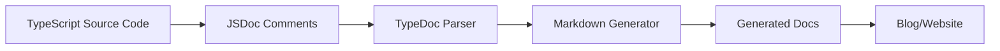

# How Documentation Works in Voice Router SDK

**A comprehensive guide to our automated documentation system**

---

## Table of Contents

1. [Overview](#overview)
2. [The Documentation Pipeline](#the-documentation-pipeline)
3. [Source Code as Documentation](#source-code-as-documentation)
4. [TypeDoc Configuration](#typedoc-configuration)
5. [Build Process](#build-process)
6. [Writing Effective JSDoc](#writing-effective-jsdoc)
7. [Documentation Structure](#documentation-structure)
8. [Best Practices](#best-practices)
9. [Troubleshooting](#troubleshooting)
10. [Future Enhancements](#future-enhancements)

---

## Overview

The Voice Router SDK uses an **automated documentation generation system** that extracts documentation directly from TypeScript source code. This approach ensures that documentation is always in sync with the codebase, reducing maintenance burden and preventing documentation drift.

### Key Principles

1. **Single Source of Truth**: Code is the documentation source
2. **Automation First**: Documentation generates automatically on every build
3. **Developer Experience**: Write once (in code), publish everywhere
4. **Type Safety**: Documentation inherits TypeScript's type system
5. **Rich Examples**: Inline code examples using @example tags

### Technology Stack

- **TypeDoc**: Converts TypeScript code and JSDoc comments to documentation
- **typedoc-plugin-markdown**: Outputs documentation as Markdown files
- **TypeScript**: Provides type information and IntelliSense
- **pnpm**: Manages build scripts and dependencies

---

## The Documentation Pipeline

The documentation generation follows a clear, automated pipeline:



### Step-by-Step Flow

1. **Developer writes code** with JSDoc comments in TypeScript files
2. **TypeDoc reads** the source files and configuration
3. **Parser extracts** types, comments, and examples
4. **Markdown generator** creates `.md` files from extracted data
5. **Documentation deployed** to `docs/generated/` directory
6. **Build process** copies docs to website/blog

### Command Execution

When you run `pnpm build`, the following happens:

```bash
pnpm build
  ├─> pnpm build:bundle    # Compile TypeScript → JavaScript/Types
  └─> pnpm build:docs      # Generate documentation
       ├─> pnpm docs:clean              # Remove old docs
       └─> pnpm docs:generate
            ├─> docs:generate:router     # Core API docs
            ├─> docs:generate:gladia     # Gladia provider docs
            └─> docs:generate:assemblyai # AssemblyAI provider docs
```

Each `docs:generate:*` command runs TypeDoc with a specific configuration file, generating documentation for that component.

---

## Source Code as Documentation

The documentation system treats **source code as the primary documentation source**. This means:

### What Gets Documented

1. **Classes**: Public classes with their methods and properties
2. **Interfaces**: Type definitions and their fields
3. **Functions**: Standalone and factory functions
4. **Type Aliases**: Custom types and unions
5. **Enums**: Enumeration types
6. **Comments**: JSDoc comments explaining behavior

### Example: From Code to Docs

**Source Code** (`src/adapters/gladia-adapter.ts`):

```typescript
/**
 * Gladia transcription provider adapter
 *
 * Implements transcription for the Gladia API with support for:
 * - Synchronous and asynchronous transcription
 * - Speaker diarization (identifying different speakers)
 * - Multi-language detection and transcription
 * - Summarization and sentiment analysis
 *
 * @see https://docs.gladia.io/ Gladia API Documentation
 *
 * @example Basic transcription
 * ```typescript
 * import { GladiaAdapter } from '@meeting-baas/sdk';
 *
 * const adapter = new GladiaAdapter();
 * adapter.initialize({
 *   apiKey: process.env.GLADIA_API_KEY
 * });
 *
 * const result = await adapter.transcribe({
 *   type: 'url',
 *   url: 'https://example.com/audio.mp3'
 * });
 * ```
 */
export class GladiaAdapter extends BaseAdapter {
  readonly name = "gladia" as const
  readonly capabilities: ProviderCapabilities = {
    streaming: true,
    diarization: true,
    // ...
  }

  /**
   * Submit audio for transcription
   *
   * @param audio - Audio input (URL, file buffer, or stream)
   * @param options - Transcription options
   * @returns Normalized transcription response
   * @throws {Error} If audio type is not supported
   */
  async transcribe(
    audio: AudioInput,
    options?: TranscribeOptions
  ): Promise<UnifiedTranscriptResponse> {
    // Implementation
  }
}
```

**Generated Documentation** (`docs/generated/gladia/README.md`):

```markdown
# GladiaAdapter

Gladia transcription provider adapter

Implements transcription for the Gladia API with support for:
- Synchronous and asynchronous transcription
- Speaker diarization (identifying different speakers)
- Multi-language detection and transcription
- Summarization and sentiment analysis

## See

https://docs.gladia.io/ Gladia API Documentation

## Examples

```typescript
import { GladiaAdapter } from '@meeting-baas/sdk';

const adapter = new GladiaAdapter();
adapter.initialize({
  apiKey: process.env.GLADIA_API_KEY
});

const result = await adapter.transcribe({
  type: 'url',
  url: 'https://example.com/audio.mp3'
});
```

## Methods

### transcribe()

Submit audio for transcription

#### Parameters

| Parameter | Type | Description |
|-----------|------|-------------|
| audio | AudioInput | Audio input (URL, file buffer, or stream) |
| options? | TranscribeOptions | Transcription options |

#### Returns

`Promise<UnifiedTranscriptResponse>` - Normalized transcription response

#### Throws

`Error` - If audio type is not supported
```

---

## TypeDoc Configuration

TypeDoc configurations control how documentation is generated. Each component has its own configuration file.

### Configuration Files

```
sdk-generator/
├── typedoc.router.config.mjs      # Core VoiceRouter API
├── typedoc.gladia.config.mjs      # Gladia provider
├── typedoc.assemblyai.config.mjs  # AssemblyAI provider
└── typedoc.config.mjs             # Main config (optional)
```

### Configuration Anatomy

Here's a breakdown of a typical TypeDoc configuration:

```javascript
/** @type {import('typedoc').TypeDocOptions} */
export default {
  // 1. ENTRY POINTS: Which files to document
  entryPoints: [
    "./src/adapters/gladia-adapter.ts"
  ],

  // 2. OUTPUT: Where to generate documentation
  out: "./docs/generated/gladia",

  // 3. PLUGINS: Extensions for enhanced output
  plugin: ["typedoc-plugin-markdown"],

  // 4. OUTPUT FORMAT: How to structure the output
  outputFileStrategy: "modules",  // One file per module
  readme: "none",                 // Don't include README

  // 5. SOURCE CONTROL: What to include
  disableSources: true,           // Don't link to source files
  excludeExternals: true,         // Skip external dependencies
  excludePrivate: false,          // Show private methods
  excludeProtected: false,        // Show protected methods
  excludeInternal: true,          // Skip @internal tagged items

  // 6. EXCLUSIONS: Files to ignore
  exclude: [
    "**/*.test.ts",               // Skip test files
    "**/*.spec.ts",               // Skip spec files
    "**/test/**/*",               // Skip test directories
    "**/src/adapters/assemblyai-adapter.ts", // Other providers
  ],

  // 7. METADATA
  name: "Voice Router SDK - Gladia Provider",
  includeVersion: true,           // Show version number
  tsconfig: "./tsconfig.json",    // TypeScript config

  // 8. ORGANIZATION: How to group items
  categorizeByGroup: true,        // Group by @group tags
  defaultCategory: "Gladia",      // Default category name

  // 9. SORTING: Order of items
  sort: ["kind", "required-first", "alphabetical"],
  sortEntryPoints: true,

  kindSortOrder: [
    "Class",
    "Interface",
    "TypeAlias",
    "Function",
    "Enum"
  ],

  // 10. NAVIGATION: Sidebar structure
  navigation: {
    includeCategories: true,      // Show categories in nav
    includeGroups: true,          // Show groups in nav
    includeFolders: true          // Show folder structure
  },

  // 11. FORMATTING: Display options
  parametersFormat: "table",      // Show parameters as table
  enumMembersFormat: "table",     // Show enum members as table

  // 12. VISIBILITY: What users can see
  visibilityFilters: {
    protected: true,              // Show protected members
    private: true,                // Show private members
    inherited: true,              // Show inherited members
    external: false               // Hide external types
  }
};
```

### Configuration per Component

#### 1. Router Core (`typedoc.router.config.mjs`)

Documents the **core VoiceRouter API** and unified types:

- Entry points: `voice-router.ts`, `types.ts`, `base-adapter.ts`
- Output: `docs/generated/router/`
- Includes: All core interfaces and the main router class

#### 2. Provider Adapters (`typedoc.gladia.config.mjs`, etc.)

Documents individual **provider implementations**:

- Entry points: Single adapter file (e.g., `gladia-adapter.ts`)
- Output: `docs/generated/{provider}/`
- Excludes: Other providers to keep docs focused
- Includes: Provider-specific implementation details

---

## Build Process

### Manual Documentation Generation

You can generate documentation independently:

```bash
# Generate all documentation
pnpm docs:generate

# Generate specific provider documentation
pnpm docs:generate:router
pnpm docs:generate:gladia
pnpm docs:generate:assemblyai

# Clean and regenerate
pnpm docs:clean && pnpm docs:generate
```

### Integrated Build

Documentation generates automatically during the standard build:

```bash
# Full build (includes documentation)
pnpm build

# Build with type generation
pnpm build:all

# Quick build (skip docs)
pnpm build:quick
```

### Build Output

After running `pnpm build`, you'll have:

```
sdk-generator/
├── dist/                           # Compiled JavaScript bundles
│   ├── index.js                   # CommonJS bundle
│   ├── index.mjs                  # ES Module bundle
│   ├── index.d.ts                 # TypeScript declarations
│   └── *.map                      # Source maps
└── docs/generated/                 # Generated documentation
    ├── assemblyai/
    │   └── README.md              # AssemblyAI adapter docs
    ├── gladia/
    │   └── README.md              # Gladia adapter docs
    └── router/
        ├── README.md              # Router index
        ├── adapters/
        │   └── base-adapter.md    # Base adapter interface
        └── router/
            ├── types.md           # Unified types
            └── voice-router.md    # VoiceRouter class
```

---

## Writing Effective JSDoc

Good documentation starts with good JSDoc comments. Here are best practices:

### Basic Structure

```typescript
/**
 * Brief one-line description
 *
 * Detailed multi-line description explaining the purpose,
 * behavior, and any important details.
 *
 * @param paramName - Description of parameter
 * @param optionalParam - Optional parameter description
 * @returns Description of return value
 * @throws {ErrorType} When error occurs
 * @example
 * ```typescript
 * // Example usage
 * const result = myFunction('value');
 * ```
 */
function myFunction(paramName: string, optionalParam?: number): Result {
  // Implementation
}
```

### Essential Tags

#### @param - Parameter Documentation

```typescript
/**
 * @param audio - Audio input (URL, file buffer, or stream)
 * @param options - Transcription options
 * @param options.language - Language code (e.g., 'en', 'es')
 * @param options.diarization - Enable speaker identification
 */
```

#### @returns - Return Value Documentation

```typescript
/**
 * @returns Normalized transcription response with text and metadata
 */
```

#### @throws - Error Documentation

```typescript
/**
 * @throws {Error} If audio type is not supported
 * @throws {TypeError} If options are invalid
 */
```

#### @example - Usage Examples

```typescript
/**
 * @example Basic usage
 * ```typescript
 * const adapter = new GladiaAdapter();
 * adapter.initialize({ apiKey: 'YOUR_KEY' });
 * ```
 *
 * @example With options
 * ```typescript
 * const result = await adapter.transcribe(audio, {
 *   language: 'en',
 *   diarization: true
 * });
 * ```
 */
```

#### @see - External References

```typescript
/**
 * @see https://docs.gladia.io/ Gladia API Documentation
 * @see https://www.assemblyai.com/docs AssemblyAI Documentation
 */
```

#### @deprecated - Deprecation Notices

```typescript
/**
 * @deprecated Use newMethod() instead. Will be removed in v7.0.0
 */
```

### Class Documentation

```typescript
/**
 * Brief class description
 *
 * Detailed explanation of the class purpose and behavior.
 * List key features:
 * - Feature 1
 * - Feature 2
 * - Feature 3
 *
 * @see https://external-docs.com
 *
 * @example Basic initialization
 * ```typescript
 * const instance = new MyClass();
 * instance.initialize(config);
 * ```
 *
 * @example Advanced usage
 * ```typescript
 * const instance = new MyClass();
 * await instance.doSomething({ option: true });
 * ```
 */
export class MyClass {
  // Implementation
}
```

### Method Documentation

```typescript
/**
 * Brief method description (one line)
 *
 * Detailed explanation of what the method does, including:
 * - How it works
 * - Side effects
 * - Performance considerations
 *
 * @param param1 - First parameter description
 * @param param2 - Second parameter description
 * @param param2.subField - Nested field description
 * @returns What the method returns
 * @throws {Error} When this error occurs
 *
 * @example Simple usage
 * ```typescript
 * const result = await obj.method('value');
 * ```
 *
 * @example With all options
 * ```typescript
 * const result = await obj.method('value', {
 *   option1: true,
 *   option2: 'custom'
 * });
 * ```
 */
async method(param1: string, param2?: Options): Promise<Result> {
  // Implementation
}
```

### Property Documentation

```typescript
/**
 * Brief property description
 *
 * Additional context about the property, including:
 * - Valid values
 * - Default value
 * - When it's set
 */
readonly propertyName: PropertyType
```

---

## Documentation Structure

### Generated File Organization

The documentation follows a hierarchical structure:

```
docs/generated/
│
├── router/                         # Core API Documentation
│   ├── README.md                  # Router module index
│   ├── adapters/
│   │   └── base-adapter.md        # BaseAdapter interface
│   └── router/
│       ├── types.md               # UnifiedTypes, AudioInput, etc.
│       └── voice-router.md        # VoiceRouter class
│
├── gladia/                         # Gladia Provider Documentation
│   └── README.md                  # GladiaAdapter class
│
└── assemblyai/                     # AssemblyAI Provider Documentation
    └── README.md                  # AssemblyAIAdapter class
```

### Markdown File Contents

Each generated markdown file includes:

1. **Title and Version**: Package name and version number
2. **Table of Contents**: Auto-generated links to sections
3. **Classes**: Exported classes with all public members
4. **Interfaces**: Type definitions
5. **Functions**: Standalone functions
6. **Type Aliases**: Custom types
7. **Enums**: Enumeration types
8. **Examples**: Code snippets from @example tags
9. **Cross-references**: Links to related types

### Navigation Structure

TypeDoc generates a navigable structure:

```markdown
# Voice Router SDK - Gladia Provider v6.0.0

## Classes

### GladiaAdapter

Gladia transcription provider adapter

#### Extends
- BaseAdapter

#### Constructors
##### Constructor
> **new GladiaAdapter**(): GladiaAdapter

#### Properties
##### name
> readonly **name**: "gladia"

##### capabilities
> readonly **capabilities**: ProviderCapabilities

#### Methods
##### initialize()
> **initialize**(config): void

##### transcribe()
> **transcribe**(audio, options?): Promise<UnifiedTranscriptResponse>

## Functions

### createGladiaAdapter()
> **createGladiaAdapter**(config): GladiaAdapter
```

---

## Best Practices

### 1. Write JSDoc as You Code

Don't defer documentation—write it alongside your code:

```typescript
// ✅ Good: Documented while writing
/**
 * Normalizes provider response to unified format
 * @param response - Raw provider response
 * @returns Unified response with standardized fields
 */
private normalizeResponse(response: RawResponse): UnifiedResponse {
  // Implementation
}

// ❌ Bad: No documentation
private normalizeResponse(response: RawResponse): UnifiedResponse {
  // Implementation
}
```

### 2. Use Descriptive Examples

Examples should be complete and realistic:

```typescript
// ✅ Good: Complete, runnable example
/**
 * @example
 * ```typescript
 * import { VoiceRouter, GladiaAdapter } from '@meeting-baas/sdk';
 *
 * const router = new VoiceRouter({
 *   providers: {
 *     gladia: { apiKey: process.env.GLADIA_API_KEY }
 *   }
 * });
 *
 * router.registerAdapter(new GladiaAdapter());
 *
 * const result = await router.transcribe({
 *   type: 'url',
 *   url: 'https://example.com/audio.mp3'
 * });
 *
 * console.log(result.data.text);
 * ```
 */

// ❌ Bad: Incomplete example
/**
 * @example
 * ```typescript
 * router.transcribe(audio)
 * ```
 */
```

### 3. Document Edge Cases

Explain non-obvious behavior:

```typescript
/**
 * Poll for transcription completion
 *
 * Note: This method will wait up to maxAttempts * intervalMs
 * milliseconds before timing out. Default is 60 attempts × 2s = 2 minutes.
 *
 * @param jobId - Transcription job identifier
 * @param maxAttempts - Maximum polling attempts (default: 60)
 * @param intervalMs - Milliseconds between polls (default: 2000)
 * @returns Completed transcription or error
 * @throws {Error} If polling times out
 */
```

### 4. Keep Documentation DRY

Reuse descriptions via interfaces:

```typescript
// Define once in interface
interface TranscribeOptions {
  /** Language code (e.g., 'en', 'es', 'fr') */
  language?: string
  /** Enable speaker identification */
  diarization?: boolean
}

// Reference in implementation
/**
 * @param options - Transcription options (see TranscribeOptions)
 */
async transcribe(audio: AudioInput, options?: TranscribeOptions) {
  // TypeDoc will link to TranscribeOptions
}
```

### 5. Update Docs When Code Changes

**Documentation is part of the code**. When you change functionality:

1. Update the JSDoc comments
2. Update examples if behavior changed
3. Add deprecation notices if needed
4. Regenerate documentation with `pnpm build:docs`

### 6. Review Generated Output

After writing JSDoc, always review the generated markdown:

```bash
pnpm build:docs
cat docs/generated/gladia/README.md
```

Check that:
- Examples render correctly
- Links work
- Tables are formatted properly
- Code blocks have syntax highlighting

---

## Troubleshooting

### Common Issues and Solutions

#### Issue 1: TypeDoc Can't Find Entry Point

**Error:**
```
[error] Unable to find any entry points. See https://typedoc.org/options/input/#entrypoints
```

**Solution:**
Check that entry points in your config file point to existing files:

```javascript
// typedoc.config.mjs
export default {
  entryPoints: [
    "./src/adapters/gladia-adapter.ts"  // ← Verify this path exists
  ]
}
```

#### Issue 2: Documentation Not Updating

**Problem:** Changes to JSDoc don't appear in generated docs.

**Solution:**
```bash
# Clean old docs and regenerate
pnpm docs:clean
pnpm docs:generate

# Or use integrated build
pnpm build
```

#### Issue 3: Code Examples Not Rendering

**Problem:** @example blocks show up as plain text.

**Solution:**
Ensure proper formatting with triple backticks and language tag:

```typescript
// ✅ Correct
/**
 * @example
 * ```typescript
 * const result = await fn();
 * ```
 */

// ❌ Incorrect (missing language tag)
/**
 * @example
 * ```
 * const result = await fn();
 * ```
 */
```

#### Issue 4: Cross-References Not Working

**Problem:** Types like `TranscribeOptions` don't link properly.

**Solution:**
1. Ensure the referenced type is exported
2. Check that it's in the entry points
3. Use full import path if needed:

```typescript
/**
 * @param options - See {@link TranscribeOptions} for details
 */
```

#### Issue 5: Too Many Warnings

**Problem:** TypeDoc generates many warnings about missing types.

**Solution:**
Adjust `visibilityFilters` and `exclude` patterns:

```javascript
export default {
  excludeExternals: true,    // Skip external dependencies
  visibilityFilters: {
    external: false          // Hide external types
  },
  exclude: [
    "**/node_modules/**",    // Skip dependencies
    "**/generated/**"        // Skip generated types
  ]
}
```

#### Issue 6: Build Fails During Documentation

**Problem:**
```
[error] TS2322: Type 'X' is not assignable to type 'Y'
```

**Solution:**
Fix TypeScript errors first—TypeDoc uses the TypeScript compiler:

```bash
# Check for TypeScript errors
pnpm tsc --noEmit

# Fix errors, then build
pnpm build
```

---

## Future Enhancements

### Planned Features

1. **Interactive API Explorer**
   - Web-based documentation browser
   - Live code examples with execution
   - API playground for testing

2. **External Guide Documents**
   - Getting started tutorials
   - Migration guides
   - Best practices documentation
   - Troubleshooting guides

3. **Multi-Format Output**
   - HTML documentation site
   - PDF exports
   - OpenAPI specification generation

4. **Enhanced Search**
   - Full-text search across all docs
   - Type-based search
   - Example code search

5. **Automated Publishing**
   - Auto-publish docs on release
   - Version-specific documentation
   - Changelog integration

6. **Contribution Guidelines**
   - Documentation style guide
   - PR documentation checks
   - Auto-generated changelog

### Roadmap

- **Q1 2025**: External guide documents integration
- **Q2 2025**: Interactive API explorer
- **Q3 2025**: Multi-format output (HTML + PDF)
- **Q4 2025**: Version-specific documentation hosting

---

## Conclusion

The Voice Router SDK's documentation system provides:

✅ **Automated generation** from source code
✅ **Always up-to-date** documentation
✅ **Rich examples** from @example tags
✅ **Type safety** from TypeScript
✅ **Multi-provider** documentation structure
✅ **Easy maintenance** with pnpm scripts

By treating code as the source of truth and using JSDoc effectively, we ensure that documentation is comprehensive, accurate, and maintainable.

---

## Quick Reference

### Commands

```bash
# Generate all documentation
pnpm docs:generate

# Generate specific provider docs
pnpm docs:generate:router
pnpm docs:generate:gladia
pnpm docs:generate:assemblyai

# Full build with docs
pnpm build

# Clean and regenerate
pnpm docs:clean && pnpm docs:generate
```

### Configuration Files

- `typedoc.router.config.mjs` - Core API configuration
- `typedoc.gladia.config.mjs` - Gladia provider configuration
- `typedoc.assemblyai.config.mjs` - AssemblyAI provider configuration

### Key JSDoc Tags

- `@param` - Parameter documentation
- `@returns` - Return value documentation
- `@throws` - Error documentation
- `@example` - Usage examples
- `@see` - External references
- `@deprecated` - Deprecation notices

### Output Structure

```
docs/generated/
├── router/      # Core API docs
├── gladia/      # Gladia provider docs
└── assemblyai/  # AssemblyAI provider docs
```

---

**Last Updated**: December 8, 2025
**SDK Version**: 6.0.0
**TypeDoc Version**: Latest

For questions or suggestions, please open an issue on GitHub.
