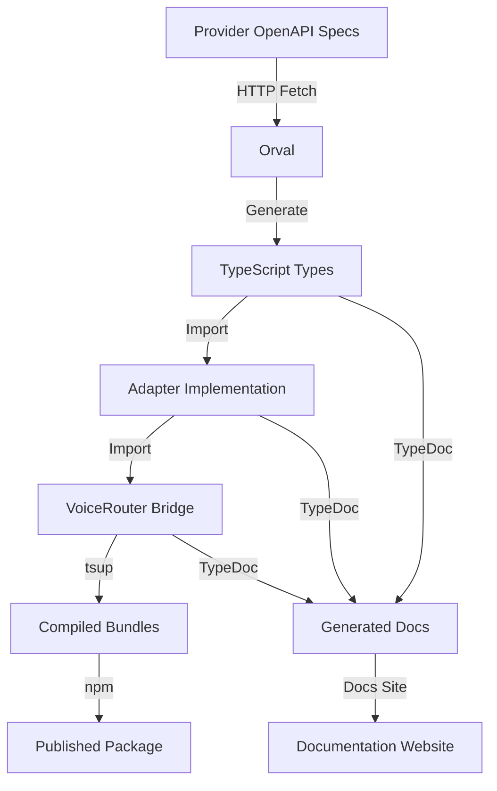

# Voice Router SDK: Complete Generation Workflow

**From OpenAPI Specifications to Production-Ready SDK**

---

## Table of Contents

1. [Overview](#overview)
2. [The Complete Pipeline](#the-complete-pipeline)
3. [Phase 1: OpenAPI Specification Fetching](#phase-1-openapi-specification-fetching)
4. [Phase 2: Type Generation with Orval](#phase-2-type-generation-with-orval)
5. [Phase 3: Adapter Implementation](#phase-3-adapter-implementation)
6. [Phase 4: SDK Compilation](#phase-4-sdk-compilation)
7. [Phase 5: Documentation Generation](#phase-5-documentation-generation)
8. [Phase 6: Publishing](#phase-6-publishing)
9. [Architecture Deep Dive](#architecture-deep-dive)
10. [Development Workflow](#development-workflow)
11. [Troubleshooting](#troubleshooting)
12. [Best Practices](#best-practices)

---

## Overview

The Voice Router SDK is a **multi-provider transcription SDK** that provides a unified interface for multiple Speech-to-Text APIs (Gladia, AssemblyAI, Deepgram, etc.). This document explains the complete workflow from raw OpenAPI specifications to a production-ready, documented SDK.

### The Journey

```
OpenAPI Specs → Type Generation → Adapter Code → SDK Build → Documentation → npm Package
```

### Key Technologies

| Technology | Purpose | Stage |
|------------|---------|-------|
| **OpenAPI/Swagger** | API specification format | Input |
| **Orval** | OpenAPI → TypeScript generator | Type Generation |
| **TypeScript** | Type-safe SDK code | Development |
| **tsup** | TypeScript bundler | Build |
| **TypeDoc** | Documentation generator | Documentation |
| **pnpm** | Package manager & scripts | Orchestration |

---

## The Complete Pipeline

### Visual Overview



### Pipeline Stages

1. **OpenAPI Fetching**: Download provider API specifications
2. **Type Generation**: Convert OpenAPI to TypeScript types
3. **Adapter Implementation**: Write provider-specific adapters
4. **Bridge Layer**: Implement unified VoiceRouter interface
5. **SDK Compilation**: Bundle TypeScript → JavaScript/ESM/CJS
6. **Documentation**: Generate markdown from JSDoc comments
7. **Publishing**: Package and publish to npm

---

## Phase 1: OpenAPI Specification Fetching

### What Are OpenAPI Specifications?

OpenAPI (formerly Swagger) is a standard format for describing REST APIs. Providers like Gladia and AssemblyAI publish their API definitions as OpenAPI JSON files.

**Example OpenAPI Structure**:
```json
{
  "openapi": "3.0.0",
  "info": {
    "title": "Gladia API",
    "version": "1.0.0"
  },
  "paths": {
    "/transcription": {
      "post": {
        "summary": "Create transcription",
        "requestBody": {
          "content": {
            "application/json": {
              "schema": {
                "$ref": "#/components/schemas/TranscriptionRequest"
              }
            }
          }
        }
      }
    }
  },
  "components": {
    "schemas": {
      "TranscriptionRequest": {
        "type": "object",
        "properties": {
          "audio_url": { "type": "string" }
        }
      }
    }
  }
}
```

### Provider OpenAPI URLs

We fetch OpenAPI specs directly from provider URLs:

```typescript
// orval.config.ts
export default {
  gladiaApi: {
    input: {
      target: "https://api.gladia.io/openapi.json",  // ← Direct URL fetch
    },
    output: {
      target: "./src/generated/gladia/schema/",
      mode: "single",
    }
  },
  assemblyaiApi: {
    input: {
      target: "https://raw.githubusercontent.com/AssemblyAI/assemblyai-api-spec/main/openapi.json",
    },
    output: {
      target: "./src/generated/assemblyai/schema/",
      mode: "single",
    }
  }
}
```

### How Fetching Works

When you run `pnpm openapi:generate`:

1. **Orval reads** the configuration file (`orval.config.ts`)
2. **HTTP GET request** to each provider's OpenAPI URL
3. **Download JSON** specification
4. **Parse and validate** the OpenAPI schema
5. **Generate TypeScript** types from the schema

### Command Flow

```bash
pnpm openapi:generate
  ↓
  pnpm openapi:clean  # Remove old generated types
  ↓
  orval --config orval.config.ts
  ↓
  For each provider:
    - Fetch OpenAPI JSON from URL
    - Parse schemas, paths, components
    - Generate TypeScript interfaces
    - Write to src/generated/{provider}/
```

### Manual vs Automatic Fetching

**Option 1: Automatic (Current)**
- Orval fetches directly from URL
- Always gets latest spec
- Requires internet connection

**Option 2: Manual Download**
```bash
# Download OpenAPI spec manually
curl https://api.gladia.io/openapi.json > gladia-openapi.json

# Update orval.config.ts to use local file
input: {
  target: "./gladia-openapi.json"
}
```

### Provider Status

| Provider | OpenAPI URL | Status | Notes |
|----------|-------------|--------|-------|
| **Gladia** | `https://api.gladia.io/openapi.json` | ✅ Working | Direct fetch |
| **AssemblyAI** | `https://raw.githubusercontent.com/AssemblyAI/assemblyai-api-spec/main/openapi.json` | ✅ Working | GitHub raw |
| **Deepgram** | `https://api.deepgram.com/openapi.json` | ❌ 404 | No public spec |

---

## Phase 2: Type Generation with Orval

### What Is Orval?

Orval is a code generator that converts OpenAPI specifications into TypeScript code. It creates:
- TypeScript interfaces for request/response types
- Zod schemas for runtime validation (optional)
- Type-safe API client code (optional)

### Orval Configuration

**File**: `orval.config.ts`

```typescript
import { defineConfig } from "orval"

export default defineConfig({
  // Gladia API Types
  gladiaApi: {
    input: {
      target: "https://api.gladia.io/openapi.json",
    },
    output: {
      target: "./src/generated/gladia/schema/",
      mode: "single",              // Generate one file per schema
      client: "axios",              // HTTP client (not used directly)
      clean: true,                  // Remove old files
      prettier: true,               // Format generated code
    },
  },

  // Gladia Zod Schemas (optional runtime validation)
  gladiaZod: {
    input: {
      target: "https://api.gladia.io/openapi.json",
    },
    output: {
      target: "./src/generated/gladia/zod/",
      mode: "single",
      client: "zod",                // Generate Zod schemas
    },
  },

  // AssemblyAI API Types
  assemblyaiApi: {
    input: {
      target: "https://raw.githubusercontent.com/AssemblyAI/assemblyai-api-spec/main/openapi.json",
    },
    output: {
      target: "./src/generated/assemblyai/schema/",
      mode: "single",
      client: "axios",
      clean: true,
      prettier: true,
    },
  },

  // AssemblyAI Zod Schemas
  assemblyaiZod: {
    input: {
      target: "https://raw.githubusercontent.com/AssemblyAI/assemblyai-api-spec/main/openapi.json",
    },
    output: {
      target: "./src/generated/assemblyai/zod/",
      mode: "single",
      client: "zod",
    },
  },
})
```

### Generation Process

**Step-by-Step**:

1. **Orval fetches OpenAPI spec** from URL
2. **Parses JSON** to extract:
   - Schemas (data types)
   - Paths (endpoints)
   - Components (reusable types)
3. **Generates TypeScript files**:
   - One file per schema component
   - Imports between related types
   - JSDoc comments from OpenAPI descriptions
4. **Writes to output directory**:
   ```
   src/generated/gladia/schema/
   ├── index.ts                      # Main export
   ├── transcript.ts                 # Transcript type
   ├── transcriptionRequest.ts       # Request type
   ├── transcriptionResponse.ts      # Response type
   └── ... (260 total files)
   ```

### Generated Type Examples

**From OpenAPI**:
```json
{
  "Transcript": {
    "type": "object",
    "properties": {
      "id": { "type": "string" },
      "text": { "type": "string" },
      "confidence": { "type": "number" }
    },
    "required": ["id"]
  }
}
```

**To TypeScript**:
```typescript
/**
 * Generated by orval v7.17.0 🍺
 * Do not edit manually.
 * Gladia API
 */

/**
 * Transcript object
 */
export interface Transcript {
  /** Unique identifier */
  id: string;
  /** Transcribed text */
  text?: string;
  /** Confidence score */
  confidence?: number;
}
```

### Why We Use `mode: "single"`

Orval supports different generation modes:

- **`tags-split`**: Generate one file per API tag (requires Node 20+ for toSorted())
- **`single`**: Generate one file per schema (works with Node 18+)

We use `single` mode due to Node 18 compatibility.

### Commands

```bash
# Generate all types
pnpm openapi:generate

# Generate specific provider
pnpm openapi:generate:gladia
pnpm openapi:generate:assemblyai

# Clean and regenerate
pnpm openapi:clean
pnpm openapi:generate
```

### Output Structure

After generation:

```
src/generated/
├── gladia/
│   ├── schema/                    # TypeScript types (260 files)
│   │   ├── index.ts
│   │   ├── transcript.ts
│   │   ├── initTranscriptionRequest.ts
│   │   └── ...
│   └── zod/                       # Zod schemas (optional)
│       └── ...
└── assemblyai/
    ├── schema/                    # TypeScript types (161 files)
    │   ├── index.ts
    │   ├── transcript.ts
    │   ├── transcriptParams.ts
    │   └── ...
    └── zod/                       # Zod schemas (optional)
        └── ...
```

---

## Phase 3: Adapter Implementation

### Adapter Architecture

An **adapter** is a class that:
1. Implements the provider's specific API
2. Uses generated types for requests/responses
3. Normalizes responses to our unified format
4. Extends the base `BaseAdapter` interface

### The Three Layers

```
┌─────────────────────────────────────────┐
│   VoiceRouter (Bridge Layer)            │  ← User-facing API
│   - Provider selection                  │
│   - Unified interface                   │
└──────────────┬──────────────────────────┘
               │
    ┌──────────┴──────────┬──────────────────┐
    │                     │                   │
┌───▼─────────────┐  ┌───▼──────────────┐  ┌▼─────────────┐
│ GladiaAdapter   │  │ AssemblyAIAdapter│  │ DeepgramA... │
│ (Provider impl) │  │ (Provider impl)  │  │ (Provider..  │
└────────┬────────┘  └──────┬───────────┘  └──┬───────────┘
         │                  │                  │
    ┌────▼──────────────────▼──────────────────▼───┐
    │   BaseAdapter (Abstract Interface)           │
    │   - initialize()                             │
    │   - transcribe()                             │
    │   - getTranscript()                          │
    │   - createErrorResponse()                    │
    └──────────────────────────────────────────────┘
```

### Base Adapter Interface

**File**: `src/adapters/base-adapter.ts`

```typescript
/**
 * Base adapter interface that all providers must implement
 */
export abstract class BaseAdapter {
  abstract name: TranscriptionProvider
  abstract capabilities: ProviderCapabilities

  protected config?: ProviderConfig

  /**
   * Initialize adapter with configuration
   */
  initialize(config: ProviderConfig): void {
    this.config = config
  }

  /**
   * Submit audio for transcription
   */
  abstract transcribe(
    audio: AudioInput,
    options?: TranscribeOptions
  ): Promise<UnifiedTranscriptResponse>

  /**
   * Get transcription result by ID
   */
  abstract getTranscript(
    transcriptId: string
  ): Promise<UnifiedTranscriptResponse>

  /**
   * Helper method to create error responses
   */
  protected createErrorResponse(
    error: unknown,
    statusCode?: number
  ): UnifiedTranscriptResponse {
    // Error handling logic
  }
}
```

### Implementing an Adapter

**Step 1: Import Generated Types**

```typescript
// src/adapters/gladia-adapter.ts
import type { Transcript } from "../generated/gladia/schema/transcript"
import type { InitTranscriptionRequest } from "../generated/gladia/schema/initTranscriptionRequest"
import type { PreRecordedResponse } from "../generated/gladia/schema/preRecordedResponse"
```

**Step 2: Create Adapter Class**

```typescript
export class GladiaAdapter extends BaseAdapter {
  readonly name = "gladia" as const
  readonly capabilities: ProviderCapabilities = {
    streaming: true,
    diarization: true,
    wordTimestamps: true,
    // ...
  }

  private client?: AxiosInstance
  private baseUrl = "https://api.gladia.io/v2"

  initialize(config: ProviderConfig): void {
    super.initialize(config)

    this.client = axios.create({
      baseURL: config.baseUrl || this.baseUrl,
      headers: {
        "x-gladia-key": config.apiKey,
      },
    })
  }
}
```

**Step 3: Implement Transcribe Method**

```typescript
async transcribe(
  audio: AudioInput,
  options?: TranscribeOptions
): Promise<UnifiedTranscriptResponse> {
  this.validateConfig()

  try {
    // Build provider-specific request using generated types
    const payload = this.buildTranscriptionRequest(audio, options)

    // Make API call
    const response = await this.client!.post<PreRecordedResponse>(
      "/transcription",
      payload
    )

    // Normalize response to unified format
    return this.normalizeResponse(response.data)
  } catch (error) {
    return this.createErrorResponse(error)
  }
}
```

**Step 4: Request Builder (Provider-Specific)**

```typescript
private buildTranscriptionRequest(
  audio: AudioInput,
  options?: TranscribeOptions
): InitTranscriptionRequest {
  const request: InitTranscriptionRequest = {
    audio_url: audio.url,
  }

  // Map unified options to provider format
  if (options?.language) {
    request.language_config = {
      languages: [options.language],
    }
  }

  if (options?.diarization) {
    request.diarization = true
  }

  // ... more mappings

  return request
}
```

**Step 5: Response Normalizer**

```typescript
private normalizeResponse(
  response: PreRecordedResponse
): UnifiedTranscriptResponse {
  // Map provider status to unified status
  let status: "queued" | "processing" | "completed" | "error"
  switch (response.status) {
    case "done":
      status = "completed"
      break
    // ... other mappings
  }

  return {
    success: true,
    provider: this.name,
    data: {
      id: response.id,
      text: response.result?.transcription?.full_transcript || "",
      confidence: undefined,  // Gladia doesn't provide overall confidence
      status,
      speakers: this.extractSpeakers(response.result?.transcription),
      words: this.extractWords(response.result?.transcription),
      // ... more fields
    },
    raw: response,  // Keep original response for debugging
  }
}
```

### Key Adapter Responsibilities

1. **API Communication**: Make HTTP requests to provider
2. **Type Safety**: Use generated types for requests/responses
3. **Option Mapping**: Convert unified options to provider format
4. **Response Normalization**: Convert provider response to unified format
5. **Error Handling**: Catch and normalize errors
6. **Polling**: Wait for async transcription completion (if needed)

### Unified Types

**File**: `src/router/types.ts`

```typescript
/**
 * Unified transcription response
 * All providers normalize to this format
 */
export interface UnifiedTranscriptResponse {
  success: boolean
  provider: TranscriptionProvider
  data?: {
    id: string
    text: string
    confidence?: number
    status: "queued" | "processing" | "completed" | "error"
    language?: string
    duration?: number
    speakers?: Array<{ id: string; label: string }>
    words?: Array<{
      text: string
      start: number
      end: number
      confidence?: number
      speaker?: string
    }>
    utterances?: Array<{
      text: string
      start: number
      end: number
      speaker?: string
      confidence?: number
      words: Array<{ text: string; start: number; end: number }>
    }>
    summary?: string
    metadata?: Record<string, unknown>
  }
  error?: {
    code: string
    message: string
    statusCode?: number
  }
  raw?: unknown  // Original provider response
}
```

---

## Phase 4: SDK Compilation

### Build Tools

We use **tsup** for bundling TypeScript into distributable formats.

**File**: `tsup.config.ts`

```typescript
import { defineConfig } from "tsup"

export default defineConfig({
  entry: { index: "src/index.ts" },
  format: ["cjs", "esm"],           // CommonJS + ES Modules
  dts: true,                        // Generate .d.ts files
  splitting: false,
  sourcemap: true,
  clean: true,
  minify: false,                    // Keep readable for debugging
  target: "es2020",
  outDir: "dist",
})
```

### Build Process

When you run `pnpm build:bundle`:

1. **tsup reads** entry point (`src/index.ts`)
2. **TypeScript compiler** processes all imports
3. **Tree shaking** removes unused code
4. **Bundle generation**:
   - `dist/index.js` - CommonJS (for Node.js require())
   - `dist/index.mjs` - ES Module (for import)
   - `dist/index.d.ts` - TypeScript declarations
   - `dist/*.map` - Source maps for debugging

### Output Structure

```
dist/
├── index.js          # CommonJS bundle (~64 KB)
├── index.js.map      # CJS source map
├── index.mjs         # ES Module bundle (~62 KB)
├── index.mjs.map     # ESM source map
├── index.d.ts        # TypeScript declarations (~301 KB)
└── index.d.mts       # ESM TypeScript declarations
```

### What Gets Bundled

**Entry Point**: `src/index.ts`

```typescript
// Export core router
export * from "./router/voice-router"
export * from "./router/types"

// Export adapters
export * from "./adapters/base-adapter"
export * from "./adapters/gladia-adapter"
export * from "./adapters/assemblyai-adapter"

// Re-export specific generated types users might need
export type { Transcript as GladiaTranscript } from "./generated/gladia/schema/transcript"
export type { Transcript as AssemblyAITranscript } from "./generated/assemblyai/schema/transcript"
```

### Package.json Exports

```json
{
  "main": "dist/index.js",
  "module": "dist/index.mjs",
  "types": "dist/index.d.ts",
  "exports": {
    ".": {
      "types": "./dist/index.d.ts",
      "import": "./dist/index.mjs",
      "require": "./dist/index.js"
    }
  }
}
```

This ensures:
- **Node.js** uses CommonJS (`require`)
- **Modern bundlers** use ES Modules (`import`)
- **TypeScript** gets type definitions

### Build Commands

```bash
# Quick bundle only
pnpm build:bundle

# Full build (bundle + docs)
pnpm build

# Full build including type generation
pnpm build:all

# Watch mode for development
pnpm dev
```

---

## Phase 5: Documentation Generation

### TypeDoc Pipeline

TypeDoc generates documentation by:

1. **Parsing TypeScript** source files
2. **Extracting JSDoc** comments
3. **Analyzing types** via TypeScript compiler
4. **Generating Markdown** via typedoc-plugin-markdown
5. **Writing files** to output directory

### Configuration Architecture

We have **separate configurations** for each component:

```
typedoc.router.config.mjs       → docs/generated/router/
typedoc.gladia.config.mjs       → docs/generated/gladia/
typedoc.assemblyai.config.mjs   → docs/generated/assemblyai/
```

### Documentation Flow

```bash
pnpm build:docs
  ↓
  pnpm docs:clean  # Remove old docs
  ↓
  pnpm docs:generate
    ├─> typedoc --options typedoc.router.config.mjs
    │   ↓
    │   Read: voice-router.ts, types.ts, base-adapter.ts
    │   Parse: JSDoc comments, TypeScript types
    │   Generate: docs/generated/router/**/*.md
    │
    ├─> typedoc --options typedoc.gladia.config.mjs
    │   ↓
    │   Read: gladia-adapter.ts
    │   Parse: JSDoc comments, class structure
    │   Generate: docs/generated/gladia/README.md
    │
    └─> typedoc --options typedoc.assemblyai.config.mjs
        ↓
        Read: assemblyai-adapter.ts
        Parse: JSDoc comments, class structure
        Generate: docs/generated/assemblyai/README.md
```

### From JSDoc to Markdown

**Input** (TypeScript source):
```typescript
/**
 * Submit audio for transcription
 *
 * @param audio - Audio input (URL, file buffer, or stream)
 * @param options - Transcription options
 * @returns Normalized transcription response
 * @throws {Error} If audio type is not supported
 *
 * @example
 * ```typescript
 * const result = await adapter.transcribe({
 *   type: 'url',
 *   url: 'https://example.com/audio.mp3'
 * });
 * ```
 */
async transcribe(
  audio: AudioInput,
  options?: TranscribeOptions
): Promise<UnifiedTranscriptResponse>
```

**Output** (Generated Markdown):
```markdown
### transcribe()

> **transcribe**(`audio`, `options?`): `Promise<UnifiedTranscriptResponse>`

Submit audio for transcription

#### Parameters

| Parameter | Type | Description |
|-----------|------|-------------|
| `audio` | `AudioInput` | Audio input (URL, file buffer, or stream) |
| `options?` | `TranscribeOptions` | Transcription options |

#### Returns

`Promise<UnifiedTranscriptResponse>` - Normalized transcription response

#### Throws

`Error` - If audio type is not supported

#### Example

```typescript
const result = await adapter.transcribe({
  type: 'url',
  url: 'https://example.com/audio.mp3'
});
```
```

### Generated Documentation Structure

```
docs/generated/
├── router/
│   ├── README.md                   # Router module index
│   ├── adapters/
│   │   └── base-adapter.md         # BaseAdapter interface docs
│   └── router/
│       ├── types.md                # Unified types docs
│       └── voice-router.md         # VoiceRouter class docs
├── gladia/
│   └── README.md                   # GladiaAdapter docs
└── assemblyai/
    └── README.md                   # AssemblyAIAdapter docs
```

---

## Phase 6: Publishing

### Pre-Publish Checklist

Before publishing to npm:

1. **Version bump** in package.json
2. **Build SDK**: `pnpm build:all`
3. **Run tests**: `pnpm test`
4. **Lint code**: `pnpm lint`
5. **Generate docs**: `pnpm build:docs`
6. **Commit changes**: Git commit
7. **Tag version**: `git tag v6.0.0`

### Publishing Process

```bash
# Automated publish (runs prepublishOnly)
pnpm publish

# Manual steps
pnpm lint:fix
pnpm build
npm publish --access public
```

### Package Contents

**Included in npm package** (via `files` in package.json):

```json
{
  "files": [
    "dist",      // Compiled bundles
    "README.md",
    "LICENSE"
  ]
}
```

**NOT included**:
- Source TypeScript files (`src/`)
- Generated types (`src/generated/`)
- Documentation (`docs/`)
- Tests (`test/`)
- Configuration files

### Package Metadata

```json
{
  "name": "@meeting-baas/sdk",
  "version": "6.0.0",
  "description": "Multi-provider transcription SDK",
  "keywords": [
    "transcription",
    "speech-to-text",
    "gladia",
    "assemblyai",
    "voice-router"
  ],
  "repository": {
    "type": "git",
    "url": "git+https://github.com/meeting-baas/sdk-generator.git"
  }
}
```

---

## Architecture Deep Dive

### Directory Structure

```
voice-router-sdk/
├── src/
│   ├── adapters/                   # Provider implementations
│   │   ├── base-adapter.ts        # Abstract base class
│   │   ├── gladia-adapter.ts      # Gladia provider
│   │   ├── assemblyai-adapter.ts  # AssemblyAI provider
│   │   └── index.ts               # Adapter exports
│   ├── generated/                  # Auto-generated types
│   │   ├── gladia/
│   │   │   └── schema/            # 260 TypeScript files
│   │   └── assemblyai/
│   │       └── schema/            # 161 TypeScript files
│   ├── router/                     # Bridge layer
│   │   ├── voice-router.ts        # Main router class
│   │   └── types.ts               # Unified types
│   └── index.ts                    # Main entry point
├── dist/                           # Compiled output (generated)
│   ├── index.js                   # CommonJS bundle
│   ├── index.mjs                  # ES Module bundle
│   └── index.d.ts                 # TypeScript declarations
├── docs/                           # Documentation
│   ├── generated/                 # Auto-generated API docs
│   │   ├── router/
│   │   ├── gladia/
│   │   └── assemblyai/
│   ├── HOW_DOCUMENTATION_WORKS.md # Doc system guide
│   └── SDK_GENERATION_WORKFLOW.md # This file
├── test/                           # Tests
│   ├── unit/
│   └── integration/
├── scripts/                        # Build scripts
│   └── test-workflow.sh           # Workflow test
├── orval.config.ts                # Type generation config
├── tsup.config.ts                 # Build config
├── typedoc.*.config.mjs           # Documentation configs
├── tsconfig.json                  # TypeScript config
├── package.json                   # Package metadata
└── README.md                      # Usage documentation
```

### Data Flow

**User Request → SDK Response**:

```
1. User calls router.transcribe()
   ↓
2. VoiceRouter selects provider (gladia/assemblyai)
   ↓
3. Selected adapter.transcribe() called
   ↓
4. Adapter builds provider-specific request
   Uses: Generated types (InitTranscriptionRequest)
   ↓
5. HTTP POST to provider API
   ↓
6. Provider responds with raw data
   Type: Provider-specific (PreRecordedResponse)
   ↓
7. Adapter normalizes response
   Output: UnifiedTranscriptResponse
   ↓
8. VoiceRouter returns to user
   Type: UnifiedTranscriptResponse
```

### Type Safety Chain

```
OpenAPI Spec (Provider)
    ↓ orval
Generated Types (Provider-specific)
    ↓ adapter imports
Adapter Implementation (Type-safe)
    ↓ normalizer
Unified Types (Provider-agnostic)
    ↓ router
User Code (Type-safe SDK usage)
```

---

## Development Workflow

### Adding a New Provider

**Step 1: Add OpenAPI Config**

```typescript
// orval.config.ts
export default defineConfig({
  // ... existing configs

  newProviderApi: {
    input: {
      target: "https://api.newprovider.com/openapi.json",
    },
    output: {
      target: "./src/generated/newprovider/schema/",
      mode: "single",
      client: "axios",
      clean: true,
    },
  },
})
```

**Step 2: Generate Types**

```bash
pnpm openapi:generate
# Or just for new provider:
orval --config orval.config.ts --project newProviderApi
```

**Step 3: Create Adapter**

```typescript
// src/adapters/newprovider-adapter.ts
import { BaseAdapter } from "./base-adapter"
import type { Transcript } from "../generated/newprovider/schema/transcript"

export class NewProviderAdapter extends BaseAdapter {
  readonly name = "newprovider" as const
  readonly capabilities = { /* ... */ }

  async transcribe(audio, options) {
    // Implementation
  }

  async getTranscript(id) {
    // Implementation
  }
}
```

**Step 4: Update Types**

```typescript
// src/router/types.ts
export type TranscriptionProvider =
  | "gladia"
  | "assemblyai"
  | "newprovider"  // ← Add here
```

**Step 5: Export Adapter**

```typescript
// src/adapters/index.ts
export * from "./newprovider-adapter"
```

**Step 6: Add TypeDoc Config**

```javascript
// typedoc.newprovider.config.mjs
export default {
  entryPoints: ["./src/adapters/newprovider-adapter.ts"],
  out: "./docs/generated/newprovider",
  // ... other config
}
```

**Step 7: Update Scripts**

```json
// package.json
{
  "scripts": {
    "docs:generate": "... && pnpm docs:generate:newprovider",
    "docs:generate:newprovider": "typedoc --options typedoc.newprovider.config.mjs"
  }
}
```

**Step 8: Test**

```bash
pnpm build
pnpm test
```

### Daily Development Commands

```bash
# Start development
pnpm dev                 # Watch mode for fast iteration

# Generate types after OpenAPI changes
pnpm openapi:generate

# Build everything
pnpm build:all           # Types + Bundle + Docs

# Quick build (no type generation)
pnpm build               # Bundle + Docs

# Test
pnpm test                # Run all tests
pnpm test:unit           # Unit tests only
pnpm test:integration    # Integration tests

# Lint
pnpm lint                # Check code
pnpm lint:fix            # Auto-fix issues

# Clean slate
pnpm clean && pnpm build:all
```

---

## Troubleshooting

### Issue 1: Orval Generation Fails

**Error:**
```
TypeError: toSorted is not a function
```

**Cause**: Using Node 18 with `mode: "tags-split"`

**Solution**:
```typescript
// orval.config.ts
output: {
  mode: "single",  // ← Use single instead of tags-split
}
```

### Issue 2: Type Imports Not Found

**Error:**
```
Cannot find module '../generated/gladia/schema/transcript'
```

**Cause**: Types not generated yet

**Solution**:
```bash
pnpm openapi:generate
```

### Issue 3: Build Fails with Type Errors

**Error:**
```
TS2322: Type 'null' is not assignable to type 'number | undefined'
```

**Cause**: Generated types include `null`, SDK expects `undefined`

**Solution**:
```typescript
// Convert null to undefined
const value = response.field !== null ? response.field : undefined
```

### Issue 4: Documentation Not Updating

**Problem**: Changes to JSDoc don't appear in docs

**Solution**:
```bash
pnpm docs:clean
pnpm docs:generate
```

### Issue 5: Provider OpenAPI Spec Changed

**Problem**: New API version breaks types

**Solution**:
```bash
# Regenerate types
pnpm openapi:generate:gladia

# Fix adapter to match new types
# Update normalizer if response structure changed

# Test thoroughly
pnpm test
```

---

## Best Practices

### 1. Version Control Generated Types

**Do commit** generated types to git:
- Enables builds without regeneration
- Provides type definitions for IDE
- Tracks API changes over time

```gitignore
# Don't ignore generated types
# src/generated/
```

### 2. Semantic Versioning

Follow semver for releases:
- **Major (v6.0.0 → v7.0.0)**: Breaking changes
- **Minor (v6.0.0 → v6.1.0)**: New features
- **Patch (v6.0.0 → v6.0.1)**: Bug fixes

### 3. Documentation as Code

Write JSDoc alongside implementation:

```typescript
// ✅ Good: Write JSDoc with code
async transcribe(audio: AudioInput) {
  /**
   * Submit audio for transcription
   * @param audio - Audio input
   */
  // Implementation
}
```

### 4. Test Coverage

Aim for:
- **Unit tests**: 80%+ coverage
- **Integration tests**: All providers
- **Error handling**: All error paths

### 5. Adapter Pattern Consistency

All adapters should:
- Extend `BaseAdapter`
- Use generated types
- Normalize responses
- Handle errors consistently
- Document with JSDoc

### 6. Build Pipeline

Standard workflow:
```bash
# 1. Type generation (when OpenAPI changes)
pnpm openapi:generate

# 2. Development
pnpm dev

# 3. Testing
pnpm test

# 4. Full build
pnpm build:all

# 5. Publish
pnpm publish
```

---

## Summary

The Voice Router SDK generation workflow consists of:

1. **OpenAPI Fetching**: Download provider API specs via HTTP
2. **Type Generation**: Convert OpenAPI → TypeScript with Orval
3. **Adapter Implementation**: Write provider-specific code using generated types
4. **SDK Compilation**: Bundle TypeScript → JavaScript/ESM/CJS with tsup
5. **Documentation**: Generate Markdown from JSDoc with TypeDoc
6. **Publishing**: Package and publish to npm

### Key Files

| File | Purpose |
|------|---------|
| `orval.config.ts` | Type generation configuration |
| `tsup.config.ts` | Build configuration |
| `typedoc.*.config.mjs` | Documentation configuration |
| `src/adapters/*-adapter.ts` | Provider implementations |
| `src/router/voice-router.ts` | Unified interface |
| `src/generated/*/schema/` | Generated types |

### Automation

Everything runs automatically with:

```bash
pnpm build:all
```

This single command:
- ✅ Generates types from OpenAPI
- ✅ Compiles TypeScript
- ✅ Bundles for distribution
- ✅ Generates documentation

The result is a **production-ready, type-safe, multi-provider SDK** with comprehensive documentation.

---

**Last Updated**: December 8, 2025
**SDK Version**: 6.0.0
**Authors**: Voice Router SDK Team

For questions or contributions, visit: https://github.com/meeting-baas/sdk-generator
