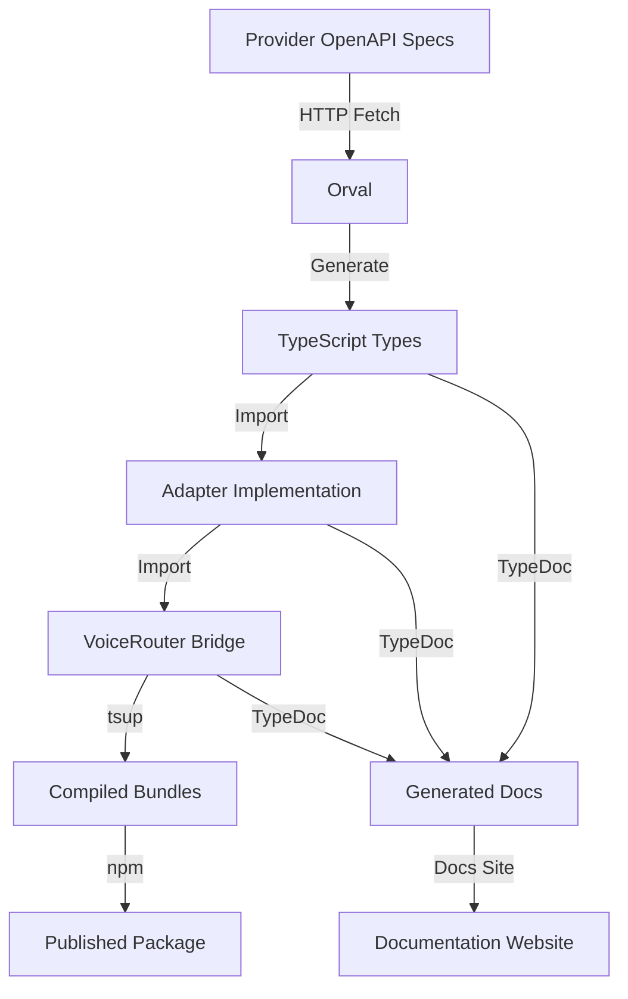

# Voice Router SDK: Complete Generation Workflow

**From OpenAPI Specifications to Production-Ready SDK**

---

## Table of Contents

1. [Overview](#overview)
2. [The Complete Pipeline](#the-complete-pipeline)
3. [Phase 1: OpenAPI Specification Fetching](#phase-1-openapi-specification-fetching)
4. [Phase 2: Type Generation with Orval](#phase-2-type-generation-with-orval)
5. [Phase 3: Adapter Implementation](#phase-3-adapter-implementation)
6. [Phase 4: SDK Compilation](#phase-4-sdk-compilation)
7. [Phase 5: Documentation Generation](#phase-5-documentation-generation)
8. [Phase 6: Publishing](#phase-6-publishing)
9. [Architecture Deep Dive](#architecture-deep-dive)
10. [Development Workflow](#development-workflow)
11. [Troubleshooting](#troubleshooting)
12. [Best Practices](#best-practices)

---

## Overview

The Voice Router SDK is a **multi-provider transcription SDK** that provides a unified interface for multiple Speech-to-Text APIs (Gladia, AssemblyAI, Deepgram, etc.). This document explains the complete workflow from raw OpenAPI specifications to a production-ready, documented SDK.

### The Journey

```
OpenAPI Specs → Type Generation → Adapter Code → SDK Build → Documentation → npm Package
```

### Key Technologies

| Technology | Purpose | Stage |
|------------|---------|-------|
| **OpenAPI/Swagger** | API specification format | Input |
| **Orval** | OpenAPI → TypeScript generator | Type Generation |
| **TypeScript** | Type-safe SDK code | Development |
| **tsup** | TypeScript bundler | Build |
| **TypeDoc** | Documentation generator | Documentation |
| **pnpm** | Package manager & scripts | Orchestration |

---

## The Complete Pipeline

### Visual Overview



### Pipeline Stages

1. **OpenAPI Fetching**: Download provider API specifications
2. **Type Generation**: Convert OpenAPI to TypeScript types
3. **Adapter Implementation**: Write provider-specific adapters
4. **Bridge Layer**: Implement unified VoiceRouter interface
5. **SDK Compilation**: Bundle TypeScript → JavaScript/ESM/CJS
6. **Documentation**: Generate markdown from JSDoc comments
7. **Publishing**: Package and publish to npm

---

## Phase 1: OpenAPI Specification Fetching

### What Are OpenAPI Specifications?

OpenAPI (formerly Swagger) is a standard format for describing REST APIs. Providers like Gladia and AssemblyAI publish their API definitions as OpenAPI JSON files.

**Example OpenAPI Structure**:
```json
{
  "openapi": "3.0.0",
  "info": {
    "title": "Gladia API",
    "version": "1.0.0"
  },
  "paths": {
    "/transcription": {
      "post": {
        "summary": "Create transcription",
        "requestBody": {
          "content": {
            "application/json": {
              "schema": {
                "$ref": "#/components/schemas/TranscriptionRequest"
              }
            }
          }
        }
      }
    }
  },
  "components": {
    "schemas": {
      "TranscriptionRequest": {
        "type": "object",
        "properties": {
          "audio_url": { "type": "string" }
        }
      }
    }
  }
}
```

### Provider OpenAPI URLs

We fetch OpenAPI specs directly from provider URLs:

```typescript
// orval.config.ts
export default {
  gladiaApi: {
    input: {
      target: "https://api.gladia.io/openapi.json",  // ← Direct URL fetch
    },
    output: {
      target: "./src/generated/gladia/schema/",
      mode: "single",
    }
  },
  assemblyaiApi: {
    input: {
      target: "https://raw.githubusercontent.com/AssemblyAI/assemblyai-api-spec/main/openapi.json",
    },
    output: {
      target: "./src/generated/assemblyai/schema/",
      mode: "single",
    }
  }
}
```

### How Fetching Works

When you run `pnpm openapi:generate`:

1. **Orval reads** the configuration file (`orval.config.ts`)
2. **HTTP GET request** to each provider's OpenAPI URL
3. **Download JSON** specification
4. **Parse and validate** the OpenAPI schema
5. **Generate TypeScript** types from the schema

### Command Flow

```bash
pnpm openapi:generate
  ↓
  pnpm openapi:clean  # Remove old generated types
  ↓
  orval --config orval.config.ts
  ↓
  For each provider:
    - Fetch OpenAPI JSON from URL
    - Parse schemas, paths, components
    - Generate TypeScript interfaces
    - Write to src/generated/{provider}/
```

### Manual vs Automatic Fetching

**Option 1: Automatic (Current)**
- Orval fetches directly from URL
- Always gets latest spec
- Requires internet connection

**Option 2: Manual Download**
```bash
# Download OpenAPI spec manually
curl https://api.gladia.io/openapi.json > gladia-openapi.json

# Update orval.config.ts to use local file
input: {
  target: "./gladia-openapi.json"
}
```

### Provider Status

| Provider | OpenAPI URL | Status | Notes |
|----------|-------------|--------|-------|
| **Gladia** | `https://api.gladia.io/openapi.json` | ✅ Working | Direct fetch |
| **AssemblyAI** | `https://raw.githubusercontent.com/AssemblyAI/assemblyai-api-spec/main/openapi.json` | ✅ Working | GitHub raw |
| **Deepgram** | `https://api.deepgram.com/openapi.json` | ❌ 404 | No public spec |

---

## Phase 2: Type Generation with Orval

### What Is Orval?

Orval is a code generator that converts OpenAPI specifications into TypeScript code. It creates:
- TypeScript interfaces for request/response types
- Zod schemas for runtime validation (optional)
- Type-safe API client code (optional)

### Orval Configuration

**File**: `orval.config.ts`

```typescript
import { defineConfig } from "orval"

export default defineConfig({
  // Gladia API Types
  gladiaApi: {
    input: {
      target: "https://api.gladia.io/openapi.json",
    },
    output: {
      target: "./src/generated/gladia/schema/",
      mode: "single",              // Generate one file per schema
      client: "axios",              // HTTP client (not used directly)
      clean: true,                  // Remove old files
      prettier: true,               // Format generated code
    },
  },

  // Gladia Zod Schemas (optional runtime validation)
  gladiaZod: {
    input: {
      target: "https://api.gladia.io/openapi.json",
    },
    output: {
      target: "./src/generated/gladia/zod/",
      mode: "single",
      client: "zod",                // Generate Zod schemas
    },
  },

  // AssemblyAI API Types
  assemblyaiApi: {
    input: {
      target: "https://raw.githubusercontent.com/AssemblyAI/assemblyai-api-spec/main/openapi.json",
    },
    output: {
      target: "./src/generated/assemblyai/schema/",
      mode: "single",
      client: "axios",
      clean: true,
      prettier: true,
    },
  },

  // AssemblyAI Zod Schemas
  assemblyaiZod: {
    input: {
      target: "https://raw.githubusercontent.com/AssemblyAI/assemblyai-api-spec/main/openapi.json",
    },
    output: {
      target: "./src/generated/assemblyai/zod/",
      mode: "single",
      client: "zod",
    },
  },
})
```

### Generation Process

**Step-by-Step**:

1. **Orval fetches OpenAPI spec** from URL
2. **Parses JSON** to extract:
   - Schemas (data types)
   - Paths (endpoints)
   - Components (reusable types)
3. **Generates TypeScript files**:
   - One file per schema component
   - Imports between related types
   - JSDoc comments from OpenAPI descriptions
4. **Writes to output directory**:
   ```
   src/generated/gladia/schema/
   ├── index.ts                      # Main export
   ├── transcript.ts                 # Transcript type
   ├── transcriptionRequest.ts       # Request type
   ├── transcriptionResponse.ts      # Response type
   └── ... (260 total files)
   ```

### Generated Type Examples

**From OpenAPI**:
```json
{
  "Transcript": {
    "type": "object",
    "properties": {
      "id": { "type": "string" },
      "text": { "type": "string" },
      "confidence": { "type": "number" }
    },
    "required": ["id"]
  }
}
```

**To TypeScript**:
```typescript
/**
 * Generated by orval v7.17.0 🍺
 * Do not edit manually.
 * Gladia API
 */

/**
 * Transcript object
 */
export interface Transcript {
  /** Unique identifier */
  id: string;
  /** Transcribed text */
  text?: string;
  /** Confidence score */
  confidence?: number;
}
```

### Why We Use `mode: "single"`

Orval supports different generation modes:

- **`tags-split`**: Generate one file per API tag (requires Node 20+ for toSorted())
- **`single`**: Generate one file per schema (works with Node 18+)

We use `single` mode due to Node 18 compatibility.

### Commands

```bash
# Generate all types
pnpm openapi:generate

# Generate specific provider
pnpm openapi:generate:gladia
pnpm openapi:generate:assemblyai

# Clean and regenerate
pnpm openapi:clean
pnpm openapi:generate
```

### Output Structure

After generation:

```
src/generated/
├── gladia/
│   ├── schema/                    # TypeScript types (260 files)
│   │   ├── index.ts
│   │   ├── transcript.ts
│   │   ├── initTranscriptionRequest.ts
│   │   └── ...
│   └── zod/                       # Zod schemas (optional)
│       └── ...
└── assemblyai/
    ├── schema/                    # TypeScript types (161 files)
    │   ├── index.ts
    │   ├── transcript.ts
    │   ├── transcriptParams.ts
    │   └── ...
    └── zod/                       # Zod schemas (optional)
        └── ...
```

---

## Phase 2.5: Post-Generation Fixes

### Overview

While Orval does an excellent job generating TypeScript types from OpenAPI specifications, the generated code sometimes contains syntax errors or type issues that prevent compilation. This is particularly problematic for **TypeDoc documentation generation**, which uses stricter type checking than regular TypeScript compilation.

### The Problem

**Orval Generation Bugs** we've encountered:

1. **Extra commas** before export statements: `,export const foo = 1;`
2. **Malformed Deepgram parameter files**: Missing `export const` declarations with orphaned properties
3. **Duplicate object properties**: Same key appearing multiple times (e.g., `null: null` appearing 3-4 times)
4. **Array default type inference**: Arrays inferred as `string[]` instead of `("value1" | "value2")[]` for Zod enums
5. **Unterminated string literals**: Unquoted strings like `opus',` instead of `'opus',`
6. **Error type shadowing**: `import type { Error }` shadowing global `Error`
7. **FormData object append**: Attempting to append objects without JSON serialization
8. **Discriminated union issues**: Missing discriminator fields in first variant
9. **Empty zod.array() calls**: `.array(zod.array())` instead of `.array(zod.array(zod.unknown()))`

### The Solution: Automated Fix Script

**File**: `scripts/fix-generated.js`

This Node.js script automatically fixes all known Orval generation issues and runs as part of the build pipeline.

### Fix Script Architecture

```javascript
// Process all generated files
function main() {
  const patterns = [".zod.ts", "Parameter.ts", "/schema/", "/api/"]
  const files = findFiles(generatedDir, patterns)

  for (const file of files) {
    let content = fs.readFileSync(file, "utf-8")

    // Apply all fixes
    content = fixExtraCommas(content, filePath)
    content = fixDeepgramParameters(content, filePath)
    content = fixUnterminatedStrings(content, filePath)
    content = fixErrorTypeShadowing(content, filePath)
    content = fixArrayDefaults(content, filePath)
    content = fixFormDataObjectAppend(content, filePath)
    content = fixDiscriminatedUnionMissingField(content, filePath)
    content = fixEmptyZodArrayCalls(content, filePath)

    if (content !== original) {
      fs.writeFileSync(file, content, "utf-8")
    }
  }
}
```

### Fix Implementations

#### 1. Extra Commas Fix

**Problem**: Biome formatter sometimes creates invalid syntax
```typescript
export const foo = 1;,export const bar = 2;  // ❌ Invalid
```

**Fix**:
```javascript
content = content.replace(/,\s*export\s+const\s+/g, "export const ")
```

**Result**:
```typescript
export const foo = 1; export const bar = 2;  // ✅ Valid
```

#### 2. Deepgram Parameter Files Reconstruction

**Problem**: Orval generates malformed parameter files
```typescript
// ❌ Malformed
export type SpeakV1EncodingParameter = typeof SpeakV1EncodingParameter[keyof typeof SpeakV1EncodingParameter] ;
opus',
  aac: 'aac',
} as const
```

**Issues**:
- Missing `export const` declaration
- Malformed property `opus',` instead of `opus: 'opus'`
- Duplicate properties in some files

**Fix Strategy**:
1. Detect missing `export const` declarations
2. Collect orphaned properties
3. Normalize malformed patterns (e.g., `opus',` → `opus: 'opus'`)
4. Remove duplicate properties (keep first occurrence)
5. Reconstruct complete file structure
6. Add missing type declarations when needed

**Result**:
```typescript
// ✅ Fixed
export type SpeakV1EncodingParameter = typeof SpeakV1EncodingParameter[keyof typeof SpeakV1EncodingParameter];

export const SpeakV1EncodingParameter = {
  opus: 'opus',
  aac: 'aac'
} as const
```

**Files Fixed**: 14 Deepgram parameter files including:
- `speakV1EncodingParameter.ts`
- `speakV1ContainerParameter.ts`
- `speakV1SampleRateParameter.ts`
- `listenV1EncodingParameter.ts`
- And 10 more management/configuration parameter files

#### 3. Array Default Type Safety (Hybrid Approach)

**Problem**: TypeDoc fails with type mismatch
```typescript
// Generated by Orval
export const arrayDefault = ["word", "segment"]  // ❌ Inferred as string[]

// Used in Zod schema
.array(zod.enum(["word", "segment"]))
.default(arrayDefault)  // ❌ Type error: string[] not assignable to ("word" | "segment")[]
```

**The Hybrid Solution**:

We implement a two-tier approach prioritizing type safety:

**Tier 1: Proper Type Annotations (Preferred)**

When the enum definition is nearby (within 20 lines), add explicit type annotations:

```javascript
// Find enum definitions and look ahead for .default() calls
for (let i = 0; i < lines.length; i++) {
  const enumMatch = line.match(/\.enum\((\[[^\]]+\])\)/)
  if (enumMatch) {
    // Look ahead 20 lines for matching .default()
    for (let j = i; j < Math.min(i + 20, lines.length); j++) {
      const defaultMatch = lines[j].match(/\.default\(([a-zA-Z]\w*Default)\)/)
      if (defaultMatch) {
        const constantName = defaultMatch[1]
        const values = enumArray.match(/"([^"]+)"|'([^']+)'/g) || []
        const unionType = values.join(" | ")
        constantTypes.set(constantName, `(${unionType})[]`)
      }
    }
  }
}

// Add type annotations
contentLines[i] = contentLines[i].replace(
  `export const ${constantName} =`,
  `export const ${constantName}: ${typeAnnotation} =`
)
```

**Result**:
```typescript
// ✅ Type-safe with explicit annotation
export const arrayDefault: ("word" | "segment")[] = ["word", "segment"]

.array(zod.enum(["word", "segment"]))
.default(arrayDefault)  // ✅ Type checks!
```

**Tier 2: `as any` Fallback (Edge Cases Only)**

For constants defined far from their enums (600+ lines away in some Gladia files), use `as any` as a pragmatic fallback:

```javascript
// Fallback for unreachable constants
content = content.replace(
  /\.default\(([a-zA-Z]\w*Default)\)/g,
  (match, constantName) => {
    const hasTypeAnnotation = new RegExp(`export const ${constantName}:[^=]+=`).test(content)
    const isArrayConstant = new RegExp(`export const ${constantName} =[\\s\\S]{0,20}\\[`).test(content)

    if (!hasTypeAnnotation && isArrayConstant) {
      return `.default(${constantName} as any)`
    }
    return match
  }
)
```

**Results Summary**:
- **OpenAI**: 1 constant with type annotation ✅
- **Gladia**: 2 constants with type annotations ✅, 22 with `as any` fallback
- **Deepgram**: 1 with `as any` fallback

**Why This Approach?**
- ✅ **Type safety where possible**: Proper type annotations for nearby enums
- ✅ **Pragmatic fallback**: `as any` only for edge cases where detection is unreliable
- ✅ **Build success**: No blocking type errors
- ✅ **Maintainable**: Clear logic for when each approach is used

#### 4. Error Type Shadowing Fix

**Problem**: Importing `Error` type shadows global `Error`
```typescript
import type { Error } from './error'  // ❌ Shadows global Error
```

**Fix**:
```javascript
content = content.replace(
  /import type \{ Error \} from '\.\/error'/g,
  "import type { Error as ErrorType } from './error'"
)

// Update all references
content = content.replace(/:\s*Error([;\s])/g, ": ErrorType$1")
content = content.replace(/Error\[\]/g, "ErrorType[]")
```

**Result**:
```typescript
import type { Error as ErrorType } from './error'  // ✅ No shadowing
function handleError(error: ErrorType): void  // ✅ Uses renamed type
```

#### 5. FormData Object Serialization

**Problem**: FormData.append() doesn't accept objects
```typescript
formData.append("chunking_strategy", chunkingStrategyObject)  // ❌ Invalid
```

**Fix**:
```javascript
content = content.replace(
  /formData\.append\("chunking_strategy",\s+(?!typeof\s)([a-zA-Z._\[\]]+)\)/g,
  "formData.append(\"chunking_strategy\", typeof $1 === 'object' ? JSON.stringify($1) : $1)"
)
```

**Result**:
```typescript
formData.append("chunking_strategy",
  typeof chunkingStrategy === 'object' ? JSON.stringify(chunkingStrategy) : chunkingStrategy
)  // ✅ Serializes objects
```

### Build Pipeline Integration

The fix script is fully integrated into the build pipeline via the `prebuild` hook:

**package.json**:
```json
{
  "scripts": {
    "prebuild": "pnpm openapi:fix-specs && pnpm openapi:fix",
    "openapi:fix": "node scripts/fix-generated.js && node scripts/fix-assemblyai-missing-schemas.js",
    "build": "pnpm build:bundle && pnpm build:docs"
  }
}
```

**Execution Flow**:
```bash
pnpm build
  ↓
prebuild hook runs automatically
  ↓
pnpm openapi:fix
  ↓
node scripts/fix-generated.js
  ↓
Scans 3,345 generated files
  ↓
Applies all fixes (typically 10-30 files modified)
  ↓
build:bundle (TypeScript compilation)
  ↓
build:docs (TypeDoc generation)
  ↓
✅ Success! 0 errors
```

### Fix Script Output

When the script runs, it provides detailed feedback:

```bash
🔧 Fixing generated TypeScript files...
Found 3345 generated files to check

✅ Fixes applied:
  - Fixed extra commas in assemblyai/api/assemblyAIAPI.zod.ts
  - Reconstructed malformed Deepgram parameter file speakV1EncodingParameter.ts
  - Reconstructed malformed Deepgram parameter file speakV1SampleRateParameter.ts
  - Fixed duplicate properties in Deepgram parameter file speakV1ContainerParameter.ts
  - Fixed duplicate properties in 10 more Deepgram parameter files
  - Added type annotations to array defaults in openai/api/openAIAPI.zod.ts (1 constants)
  - Added type annotations to array defaults in gladia/api/gladiaControlAPI.zod.ts (2 constants)
  - Added 'as any' fallback for 22 array defaults in gladia/api/gladiaControlAPI.zod.ts
  - Fixed FormData object append in openai/api/openAIAPI.ts
  - Fixed discriminated union to regular union in openai/api/openAIAPI.zod.ts
  - Fixed empty zod.array() calls in gladia/api/gladiaControlAPI.zod.ts
```

### Build Results

With all fixes applied:

✅ **TypeScript Compilation**: 0 errors
✅ **Bundle Generation**: dist/ created successfully
✅ **TypeDoc Documentation**: All 8 providers generated successfully
✅ **Only Warnings**: Documentation reference warnings (acceptable)

**Before Fixes**:
```bash
❌ Found 10 errors
src/generated/deepgram/schema/speakV1EncodingParameter.ts:14:47 - error TS2693
src/generated/openai/api/openAIAPI.zod.ts:612:1 - error TS1005
...
```

**After Fixes**:
```bash
✅ Found 0 errors
📦 dist/index.js     150.60 KB
📦 dist/index.mjs    147.22 KB
📚 markdown generated at ./docs/generated/router
📚 markdown generated at ./docs/generated/deepgram
...
```

### Maintenance

**Adding New Fixes**:

When encountering new Orval generation issues:

1. **Identify the pattern** in generated files
2. **Write a fix function** following the existing pattern:
   ```javascript
   function fixNewIssue(content, filePath) {
     const before = content

     // Apply fix using regex or line-by-line parsing
     content = content.replace(/pattern/g, "replacement")

     if (content !== before) {
       fixes.push(`Fixed new issue in ${filePath}`)
     }

     return content
   }
   ```
3. **Add to processFile()** in the fix pipeline
4. **Test thoroughly** with `pnpm build`
5. **Document the fix** in this section

**Testing Fixes**:
```bash
# Clean and regenerate to test fixes
pnpm openapi:clean
pnpm openapi:generate  # Generates with issues
node scripts/fix-generated.js  # Applies fixes
pnpm build  # Should succeed
```

### Summary

The post-generation fix script is a critical part of the build pipeline that:

✅ **Automatically fixes** 9 categories of Orval generation issues
✅ **Processes 3,345 files** in seconds
✅ **Enables TypeDoc** to generate documentation without errors
✅ **Uses hybrid approach** for type safety (proper types where possible, `as any` only for edge cases)
✅ **Runs automatically** as part of every build
✅ **Provides clear feedback** on what was fixed
✅ **Maintains build reliability** even when upstream OpenAPI specs change

The result is a **fully automated, reliable build pipeline** that transforms imperfect generated code into production-ready TypeScript.

---

## Phase 3: Adapter Implementation

### Adapter Architecture

An **adapter** is a class that:
1. Implements the provider's specific API
2. Uses generated types for requests/responses
3. Normalizes responses to our unified format
4. Extends the base `BaseAdapter` interface

### The Three Layers

```
┌─────────────────────────────────────────┐
│   VoiceRouter (Bridge Layer)            │  ← User-facing API
│   - Provider selection                  │
│   - Unified interface                   │
└──────────────┬──────────────────────────┘
               │
    ┌──────────┴──────────┬──────────────────┐
    │                     │                   │
┌───▼─────────────┐  ┌───▼──────────────┐  ┌▼─────────────┐
│ GladiaAdapter   │  │ AssemblyAIAdapter│  │ DeepgramA... │
│ (Provider impl) │  │ (Provider impl)  │  │ (Provider..  │
└────────┬────────┘  └──────┬───────────┘  └──┬───────────┘
         │                  │                  │
    ┌────▼──────────────────▼──────────────────▼───┐
    │   BaseAdapter (Abstract Interface)           │
    │   - initialize()                             │
    │   - transcribe()                             │
    │   - getTranscript()                          │
    │   - createErrorResponse()                    │
    └──────────────────────────────────────────────┘
```

### Base Adapter Interface

**File**: `src/adapters/base-adapter.ts`

```typescript
/**
 * Base adapter interface that all providers must implement
 */
export abstract class BaseAdapter {
  abstract name: TranscriptionProvider
  abstract capabilities: ProviderCapabilities

  protected config?: ProviderConfig

  /**
   * Initialize adapter with configuration
   */
  initialize(config: ProviderConfig): void {
    this.config = config
  }

  /**
   * Submit audio for transcription
   */
  abstract transcribe(
    audio: AudioInput,
    options?: TranscribeOptions
  ): Promise<UnifiedTranscriptResponse>

  /**
   * Get transcription result by ID
   */
  abstract getTranscript(
    transcriptId: string
  ): Promise<UnifiedTranscriptResponse>

  /**
   * Helper method to create error responses
   */
  protected createErrorResponse(
    error: unknown,
    statusCode?: number
  ): UnifiedTranscriptResponse {
    // Error handling logic
  }
}
```

### Implementing an Adapter

**Step 1: Import Generated Types**

```typescript
// src/adapters/gladia-adapter.ts
import type { Transcript } from "../generated/gladia/schema/transcript"
import type { InitTranscriptionRequest } from "../generated/gladia/schema/initTranscriptionRequest"
import type { PreRecordedResponse } from "../generated/gladia/schema/preRecordedResponse"
```

**Step 2: Create Adapter Class**

```typescript
export class GladiaAdapter extends BaseAdapter {
  readonly name = "gladia" as const
  readonly capabilities: ProviderCapabilities = {
    streaming: true,
    diarization: true,
    wordTimestamps: true,
    // ...
  }

  private client?: AxiosInstance
  private baseUrl = "https://api.gladia.io/v2"

  initialize(config: ProviderConfig): void {
    super.initialize(config)

    this.client = axios.create({
      baseURL: config.baseUrl || this.baseUrl,
      headers: {
        "x-gladia-key": config.apiKey,
      },
    })
  }
}
```

**Step 3: Implement Transcribe Method**

```typescript
async transcribe(
  audio: AudioInput,
  options?: TranscribeOptions
): Promise<UnifiedTranscriptResponse> {
  this.validateConfig()

  try {
    // Build provider-specific request using generated types
    const payload = this.buildTranscriptionRequest(audio, options)

    // Make API call
    const response = await this.client!.post<PreRecordedResponse>(
      "/transcription",
      payload
    )

    // Normalize response to unified format
    return this.normalizeResponse(response.data)
  } catch (error) {
    return this.createErrorResponse(error)
  }
}
```

**Step 4: Request Builder (Provider-Specific)**

```typescript
private buildTranscriptionRequest(
  audio: AudioInput,
  options?: TranscribeOptions
): InitTranscriptionRequest {
  const request: InitTranscriptionRequest = {
    audio_url: audio.url,
  }

  // Map unified options to provider format
  if (options?.language) {
    request.language_config = {
      languages: [options.language],
    }
  }

  if (options?.diarization) {
    request.diarization = true
  }

  // ... more mappings

  return request
}
```

**Step 5: Response Normalizer**

```typescript
private normalizeResponse(
  response: PreRecordedResponse
): UnifiedTranscriptResponse {
  // Map provider status to unified status
  let status: "queued" | "processing" | "completed" | "error"
  switch (response.status) {
    case "done":
      status = "completed"
      break
    // ... other mappings
  }

  return {
    success: true,
    provider: this.name,
    data: {
      id: response.id,
      text: response.result?.transcription?.full_transcript || "",
      confidence: undefined,  // Gladia doesn't provide overall confidence
      status,
      speakers: this.extractSpeakers(response.result?.transcription),
      words: this.extractWords(response.result?.transcription),
      // ... more fields
    },
    raw: response,  // Keep original response for debugging
  }
}
```

### Key Adapter Responsibilities

1. **API Communication**: Make HTTP requests to provider
2. **Type Safety**: Use generated types for requests/responses
3. **Option Mapping**: Convert unified options to provider format
4. **Response Normalization**: Convert provider response to unified format
5. **Error Handling**: Catch and normalize errors
6. **Polling**: Wait for async transcription completion (if needed)

### Unified Types

**File**: `src/router/types.ts`

```typescript
/**
 * Unified transcription response (Batch/Async)
 * All providers normalize to this format
 */
export interface UnifiedTranscriptResponse {
  success: boolean
  provider: TranscriptionProvider
  data?: {
    id: string
    text: string
    confidence?: number
    status: "queued" | "processing" | "completed" | "error"
    language?: string
    duration?: number
    speakers?: Array<{ id: string; label: string }>
    words?: Array<{
      text: string
      start: number
      end: number
      confidence?: number
      speaker?: string
    }>
    utterances?: Array<{
      text: string
      start: number
      end: number
      speaker?: string
      confidence?: number
      words: Array<{ text: string; start: number; end: number }>
    }>
    summary?: string
    metadata?: Record<string, unknown>
  }
  error?: {
    code: string
    message: string
    statusCode?: number
  }
  raw?: unknown  // Original provider response
}

/**
 * Streaming Types (Real-time)
 * For WebSocket-based real-time transcription
 */
export interface StreamingSession {
  id: string
  provider: TranscriptionProvider
  sendAudio: (chunk: AudioChunk) => Promise<void>
  close: () => Promise<void>
  getStatus: () => "connecting" | "open" | "closing" | "closed"
  createdAt: Date
}

export interface StreamingOptions {
  encoding?: string        // 'linear16', 'mulaw', etc.
  sampleRate?: number      // 16000, 48000, etc.
  channels?: number        // 1 (mono), 2 (stereo)
  bitDepth?: number        // 16, 24, etc.
  language?: string
  diarization?: boolean
  interimResults?: boolean // Get partial transcripts
  // ... other transcription options
}

export interface StreamingCallbacks {
  onOpen?: () => void
  onTranscript?: (event: StreamEvent) => void
  onUtterance?: (utterance: Utterance) => void
  onMetadata?: (metadata: Record<string, unknown>) => void
  onError?: (error: { code: string; message: string }) => void
  onClose?: (code?: number, reason?: string) => void
}
```

---

## Phase 3.5: Streaming Architecture (Real-time Transcription)

### Overview

In addition to batch transcription, the SDK supports **real-time streaming transcription** via WebSocket connections. This enables low-latency, live audio processing with interim results.

### Streaming vs Batch

| Feature | Batch Transcription | Streaming Transcription |
|---------|-------------------|------------------------|
| **Latency** | Minutes (async processing) | Milliseconds (real-time) |
| **Protocol** | REST API + Polling | WebSocket |
| **Results** | Single final transcript | Interim + final transcripts |
| **Use Case** | Pre-recorded audio files | Live audio (microphone, calls) |
| **Complexity** | Simple (one request) | Complex (connection management) |

### Streaming Flow Diagram

```
User Audio Stream → SDK StreamingSession → WebSocket → Provider API
                                          ←            ← Interim Results
                                          ←            ← Final Results
```

### Implementation Architecture

**1. Initialize Session**
```typescript
const session = await adapter.transcribeStream({
  encoding: 'linear16',
  sampleRate: 16000,
  channels: 1,
  language: 'en'
}, {
  onTranscript: (event) => console.log(event.text),
  onError: (error) => console.error(error)
});
```

**2. Send Audio Chunks**
```typescript
// Stream audio in chunks
while (hasMoreAudio) {
  const audioChunk = getNextAudioChunk() // Your audio source
  await session.sendAudio({ data: audioChunk })
}

// Signal last chunk
await session.sendAudio({
  data: lastChunk,
  isLast: true
})
```

**3. Handle Results**
```typescript
// Callbacks are invoked automatically
onTranscript: (event) => {
  if (event.isFinal) {
    console.log('Final:', event.text)
    // Save to database, display to user, etc.
  } else {
    console.log('Interim:', event.text)
    // Update UI with partial results
  }
}
```

**4. Clean Up**
```typescript
await session.close()
```

### Provider-Specific Streaming

Each provider implements streaming differently:

#### Deepgram Streaming
- **Protocol**: Direct WebSocket with query params
- **Auth**: `Token ${apiKey}` header
- **Message Format**: JSON with `type: "Results"`
- **Features**: Interim results, utterance detection, speaker diarization
```typescript
// URL: wss://api.deepgram.com/v1/listen?encoding=linear16&sample_rate=16000
// Send: Raw audio bytes
// Receive: { type: "Results", channel: { alternatives: [...] } }
```

#### AssemblyAI Streaming
- **Protocol**: Token-based WebSocket
- **Auth**: Temporary token from `/realtime/token` endpoint
- **Message Format**: JSON with `message_type`
- **Features**: Partial + final transcripts, word timings
```typescript
// Step 1: POST /realtime/token → { token }
// Step 2: wss://api.assemblyai.com/v2/realtime/ws?token=${token}
// Send: { audio_data: base64String }
// Receive: { message_type: "PartialTranscript", text: "..." }
```

#### Gladia Streaming
- **Protocol**: REST init → WebSocket URL
- **Auth**: API key in init request
- **Message Format**: JSON with event types
- **Features**: Utterances, post-processing, translations
```typescript
// Step 1: POST /streaming/init → { id, url }
// Step 2: Connect to WebSocket URL
// Send: Raw audio bytes
// Receive: { type: "transcript", text: "...", is_final: true }
```

#### Azure STT Streaming
- **Status**: ❌ Not supported (batch only in SDK v3.1)
- **Note**: Azure has WebSocket streaming but requires different API version

### Streaming Types Deep Dive

**StreamingSession** - Active connection handle
```typescript
interface StreamingSession {
  id: string                    // Unique session ID
  provider: TranscriptionProvider
  sendAudio: (chunk: AudioChunk) => Promise<void>
  close: () => Promise<void>
  getStatus: () => "connecting" | "open" | "closing" | "closed"
  createdAt: Date
}
```

**AudioChunk** - Audio data packet
```typescript
interface AudioChunk {
  data: Buffer | Uint8Array    // Audio bytes
  isLast?: boolean             // Signal end of stream
}
```

**StreamingCallbacks** - Event handlers
```typescript
interface StreamingCallbacks {
  onOpen?: () => void                        // Connection established
  onTranscript?: (event: StreamEvent) => void // Transcript received
  onUtterance?: (utterance: Utterance) => void // Complete utterance
  onMetadata?: (meta: Record) => void         // Session metadata
  onError?: (error: Error) => void            // Error occurred
  onClose?: (code?, reason?) => void          // Connection closed
}
```

**StreamEvent** - Transcript event
```typescript
interface StreamEvent {
  type: "open" | "transcript" | "utterance" | "metadata" | "error" | "close"
  text?: string              // Transcript text
  isFinal?: boolean          // Is this the final version?
  words?: Word[]             // Word-level timings
  confidence?: number        // Confidence score
  speaker?: string           // Speaker ID (if diarization)
}
```

### Error Handling in Streaming

Streaming requires robust error handling:

```typescript
const session = await adapter.transcribeStream(options, {
  onError: (error) => {
    if (error.code === 'WEBSOCKET_ERROR') {
      // Connection lost - implement reconnection logic
      reconnect()
    } else if (error.code === 'PARSE_ERROR') {
      // Malformed message - log and continue
      console.error('Parse error:', error)
    } else {
      // Fatal error - stop streaming
      session.close()
    }
  },
  onClose: (code, reason) => {
    console.log(`Connection closed: ${code} - ${reason}`)
    // Clean up resources
  }
})
```

### Performance Considerations

**Buffering Strategy**
```typescript
// Collect audio chunks before sending
const buffer: Buffer[] = []
const CHUNK_SIZE = 8000 // bytes

while (recording) {
  const sample = await microphone.read()
  buffer.push(sample)

  if (buffer.length >= CHUNK_SIZE) {
    const chunk = Buffer.concat(buffer)
    await session.sendAudio({ data: chunk })
    buffer.length = 0 // Clear buffer
  }
}
```

**Latency Optimization**
- Send smaller chunks (e.g., 100ms of audio) for lower latency
- Send larger chunks (e.g., 500ms) for better network efficiency
- Enable `interimResults` for real-time feedback
- Trade-off: Latency vs accuracy vs bandwidth

### Testing Streaming

Testing streaming requires different approaches:

```typescript
// Mock audio stream for testing
async function testStreaming() {
  const adapter = new DeepgramAdapter()
  adapter.initialize({ apiKey: 'test-key' })

  const transcripts: string[] = []

  const session = await adapter.transcribeStream({
    encoding: 'linear16',
    sampleRate: 16000
  }, {
    onTranscript: (event) => {
      if (event.isFinal) {
        transcripts.push(event.text)
      }
    }
  })

  // Simulate sending audio chunks
  for (let i = 0; i < 10; i++) {
    const mockAudio = generateTestAudio() // Mock function
    await session.sendAudio({
      data: mockAudio,
      isLast: i === 9
    })
  }

  await session.close()

  expect(transcripts.length).toBeGreaterThan(0)
}
```

### Streaming Checklist

When implementing streaming for a new provider:

- [ ] Research provider's WebSocket API documentation
- [ ] Determine authentication method (header, token, query param)
- [ ] Map provider message formats to `StreamEvent`
- [ ] Implement connection lifecycle (open, send, close)
- [ ] Handle interim vs final results
- [ ] Extract word-level timings if available
- [ ] Support speaker diarization if available
- [ ] Add comprehensive error handling
- [ ] Write JSDoc with streaming examples
- [ ] Test with real audio streams
- [ ] Document audio format requirements

---

## Phase 3.6: Webhook Normalization (Callback Handling)

### Overview

While streaming (Phase 3.5) handles **real-time transcription**, and batch adapters handle **asynchronous job submission**, webhooks provide the **callback mechanism** when transcriptions complete. Each provider sends webhook notifications in different formats, requiring normalization.

### The Problem

**Provider-specific webhook formats**:

| Provider | Webhook Format | Signature Verification |
|----------|---------------|------------------------|
| Gladia | `{event: "transcription.success", payload: {id}}` | ❌ None |
| AssemblyAI | `{transcript_id, status: "completed"}` | ✅ HMAC-SHA256 |
| Deepgram | Full `ListenV1Response` object | ❌ None |
| Azure STT | `{action: "TranscriptionSucceeded", timestamp, self}` | ✅ HMAC-SHA256 (optional) |

### The Solution: Webhook Router

A unified `WebhookRouter` with automatic provider detection and normalized event format.

### Implementation Architecture

```
Incoming Webhook → WebhookRouter.route() → Auto-detect Provider → Provider Handler → UnifiedWebhookEvent
                                                                      ↓
                                                          Signature Verification (if supported)
```

### Core Components

#### 1. Unified Webhook Types

**File**: `src/webhooks/types.ts`

```typescript
// Unified event types across all providers
export type WebhookEventType =
  | "transcription.created"       // Job created/queued
  | "transcription.processing"    // Job started processing
  | "transcription.completed"     // Job completed successfully
  | "transcription.failed"        // Job failed with error
  | "live.session_started"        // Live streaming session started
  | "live.session_ended"          // Live streaming session ended
  | "live.transcript"             // Live transcript update

// Normalized webhook event structure
export interface UnifiedWebhookEvent {
  success: boolean
  provider: TranscriptionProvider
  eventType: WebhookEventType
  data?: {
    id: string
    status: TranscriptionStatus
    text?: string
    confidence?: number
    duration?: number
    language?: string
    speakers?: Speaker[]
    words?: Word[]
    utterances?: Utterance[]
    summary?: string
    error?: string
    metadata?: Record<string, unknown>
  }
  timestamp: string
  raw: unknown  // Original payload for debugging
}
```

#### 2. Base Webhook Handler

**File**: `src/webhooks/base-webhook.ts`

Abstract base class that all provider handlers extend:

```typescript
export abstract class BaseWebhookHandler {
  abstract readonly provider: TranscriptionProvider

  // Detect if payload matches this provider's format
  abstract matches(payload: unknown): boolean

  // Parse provider payload to UnifiedWebhookEvent
  abstract parse(payload: unknown): UnifiedWebhookEvent

  // Optional signature verification
  verify?(payload: unknown, options: WebhookVerificationOptions): boolean

  // Validate payload structure
  validate(payload: unknown): WebhookValidation {
    // Default implementation using matches() and parse()
  }
}
```

#### 3. Provider-Specific Handlers

Each provider has a dedicated handler:

**Gladia Handler** (`src/webhooks/gladia-webhook.ts`):
```typescript
export class GladiaWebhookHandler extends BaseWebhookHandler {
  readonly provider = "gladia"

  matches(payload: unknown): boolean {
    // Check for {event, payload} structure
    return payload.event?.startsWith("transcription.")
  }

  parse(payload: unknown): UnifiedWebhookEvent {
    // Map event: "transcription.success" → eventType: "transcription.completed"
    // Return normalized event
  }
}
```

**AssemblyAI Handler** (`src/webhooks/assemblyai-webhook.ts`):
```typescript
export class AssemblyAIWebhookHandler extends BaseWebhookHandler {
  readonly provider = "assemblyai"

  verify(payload: unknown, options: WebhookVerificationOptions): boolean {
    // HMAC-SHA256 signature verification
    const computed = crypto.createHmac('sha256', secret).update(body).digest('hex')
    return crypto.timingSafeEqual(Buffer.from(signature), Buffer.from(computed))
  }
}
```

**Deepgram Handler** (`src/webhooks/deepgram-webhook.ts`):
```typescript
export class DeepgramWebhookHandler extends BaseWebhookHandler {
  parse(payload: unknown): UnifiedWebhookEvent {
    // Deepgram sends full ListenV1Response
    // Extract transcript, words, speakers, utterances, etc.
    // Return comprehensive normalized event
  }
}
```

**Azure Handler** (`src/webhooks/azure-webhook.ts`):
```typescript
export class AzureWebhookHandler extends BaseWebhookHandler {
  parse(payload: unknown): UnifiedWebhookEvent {
    // Map action: "TranscriptionSucceeded" → eventType: "transcription.completed"
    // Extract transcription ID from self link
  }
}
```

#### 4. Webhook Router

**File**: `src/webhooks/webhook-router.ts`

Central routing with auto-detection:

```typescript
export class WebhookRouter {
  private handlers: Map<TranscriptionProvider, BaseWebhookHandler>

  route(payload: unknown, options?: WebhookRouterOptions): WebhookRouterResult {
    // 1. Detect provider (if not specified)
    const provider = options?.provider || this.detectProvider(payload)

    // 2. Get provider handler
    const handler = this.handlers.get(provider)

    // 3. Verify signature (if requested and supported)
    if (options?.verification && handler.verify) {
      const verified = handler.verify(payload, options.verification)
      if (!verified) return { success: false, verified: false }
    }

    // 4. Validate payload
    const validation = handler.validate(payload)
    if (!validation.valid) return { success: false, error: validation.error }

    // 5. Parse to UnifiedWebhookEvent
    const event = handler.parse(payload)

    return { success: true, provider, event, verified: true }
  }

  detectProvider(payload: unknown): TranscriptionProvider | undefined {
    // Try each handler's matches() method
    for (const [provider, handler] of this.handlers) {
      if (handler.matches(payload)) return provider
    }
  }
}
```

### Usage Examples

#### Express.js Webhook Endpoint

```typescript
import express from 'express';
import { WebhookRouter } from '@meeting-baas/sdk';

const app = express();
const router = new WebhookRouter();

// Single endpoint handles all transcription providers
app.post('/webhooks/transcription', express.json(), (req, res) => {
  const result = router.route(req.body, {
    verification: {
      signature: req.headers['x-signature'] as string,
      secret: process.env.WEBHOOK_SECRET!
    }
  });

  if (!result.success) {
    return res.status(400).json({ error: result.error });
  }

  // Unified event format across all providers
  console.log('Provider:', result.provider);
  console.log('Event:', result.event?.eventType);

  if (result.event?.eventType === 'transcription.completed') {
    // Fetch full transcript
    console.log('Transcript ID:', result.event.data?.id);
  }

  res.status(200).json({ received: true });
});
```

#### Provider-Specific Handler

```typescript
import { GladiaWebhookHandler } from '@meeting-baas/sdk';

const handler = new GladiaWebhookHandler();

// Validate
const validation = handler.validate(req.body);
if (!validation.valid) {
  return res.status(400).json({ error: validation.error });
}

// Parse
const event = handler.parse(req.body);
console.log('Job ID:', event.data?.id);
```

### Security: Signature Verification

#### AssemblyAI Signature Verification

```typescript
const result = router.route(req.body, {
  verification: {
    signature: req.headers['x-assemblyai-signature'],
    secret: process.env.ASSEMBLYAI_WEBHOOK_SECRET,
    rawBody: req.rawBody  // Must be raw body for HMAC
  }
});

if (!result.verified) {
  return res.status(401).json({ error: 'Invalid signature' });
}
```

#### Azure Signature Verification

```typescript
const result = router.route(req.body, {
  provider: 'azure-stt',  // Skip auto-detection
  verification: {
    signature: req.headers['x-azure-signature'],
    secret: process.env.AZURE_WEBHOOK_SECRET
  }
});
```

### Documentation Generation

Webhook documentation is automatically generated via TypeDoc:

**Command**: `pnpm docs:generate:webhooks`

**Config**: `typedoc.webhooks.config.mjs`

```javascript
export default {
  entryPoints: [
    "./src/webhooks/index.ts",
    "./src/webhooks/types.ts",
    "./src/webhooks/webhook-router.ts",
    "./src/webhooks/base-webhook.ts",
    "./src/webhooks/gladia-webhook.ts",
    "./src/webhooks/assemblyai-webhook.ts",
    "./src/webhooks/deepgram-webhook.ts",
    "./src/webhooks/azure-webhook.ts"
  ],
  out: "./docs/generated/webhooks",
  // ...
}
```

**Generated documentation includes**:
- Complete API reference for all webhook classes
- Type definitions with descriptions
- Usage examples extracted from JSDoc
- Provider-specific webhook formats

### Testing Webhooks

You can test webhook handlers with sample payloads:

```typescript
import { WebhookRouter } from '@meeting-baas/sdk';

const router = new WebhookRouter();

// Test Gladia webhook
const gladiaPayload = {
  event: "transcription.success",
  payload: { id: "abc-123" }
};

const result = router.route(gladiaPayload);
console.assert(result.provider === 'gladia');
console.assert(result.event?.eventType === 'transcription.completed');
```

### Key Benefits

✅ **Single webhook endpoint** for all providers
✅ **Automatic provider detection** from payload structure
✅ **Unified event format** - same interface regardless of provider
✅ **Type-safe** - Full TypeScript support with generated types
✅ **Signature verification** - Security for supported providers
✅ **Comprehensive validation** - Catch malformed payloads early
✅ **Original payload preserved** - Access raw data when needed

---

## Phase 4: SDK Compilation

### Build Tools

We use **tsup** for bundling TypeScript into distributable formats.

**File**: `tsup.config.ts`

```typescript
import { defineConfig } from "tsup"

export default defineConfig({
  entry: { index: "src/index.ts" },
  format: ["cjs", "esm"],           // CommonJS + ES Modules
  dts: true,                        // Generate .d.ts files
  splitting: false,
  sourcemap: true,
  clean: true,
  minify: false,                    // Keep readable for debugging
  target: "es2020",
  outDir: "dist",
})
```

### Build Process

When you run `pnpm build:bundle`:

1. **tsup reads** entry point (`src/index.ts`)
2. **TypeScript compiler** processes all imports
3. **Tree shaking** removes unused code
4. **Bundle generation**:
   - `dist/index.js` - CommonJS (for Node.js require())
   - `dist/index.mjs` - ES Module (for import)
   - `dist/index.d.ts` - TypeScript declarations
   - `dist/*.map` - Source maps for debugging

### Output Structure

```
dist/
├── index.js          # CommonJS bundle (~64 KB)
├── index.js.map      # CJS source map
├── index.mjs         # ES Module bundle (~62 KB)
├── index.mjs.map     # ESM source map
├── index.d.ts        # TypeScript declarations (~301 KB)
└── index.d.mts       # ESM TypeScript declarations
```

### What Gets Bundled

**Entry Point**: `src/index.ts`

```typescript
// Export core router
export * from "./router/voice-router"
export * from "./router/types"

// Export adapters
export * from "./adapters/base-adapter"
export * from "./adapters/gladia-adapter"
export * from "./adapters/assemblyai-adapter"

// Re-export specific generated types users might need
export type { Transcript as GladiaTranscript } from "./generated/gladia/schema/transcript"
export type { Transcript as AssemblyAITranscript } from "./generated/assemblyai/schema/transcript"
```

### Package.json Exports

```json
{
  "main": "dist/index.js",
  "module": "dist/index.mjs",
  "types": "dist/index.d.ts",
  "exports": {
    ".": {
      "types": "./dist/index.d.ts",
      "import": "./dist/index.mjs",
      "require": "./dist/index.js"
    }
  }
}
```

This ensures:
- **Node.js** uses CommonJS (`require`)
- **Modern bundlers** use ES Modules (`import`)
- **TypeScript** gets type definitions

### Build Commands

```bash
# Quick bundle only
pnpm build:bundle

# Full build (bundle + docs)
pnpm build

# Full build including type generation
pnpm build:all

# Watch mode for development
pnpm dev
```

---

## Phase 5: Documentation Generation

### TypeDoc Pipeline

TypeDoc generates documentation by:

1. **Parsing TypeScript** source files
2. **Extracting JSDoc** comments
3. **Analyzing types** via TypeScript compiler
4. **Generating Markdown** via typedoc-plugin-markdown
5. **Writing files** to output directory

### Configuration Architecture

We have **separate configurations** for each component:

```
typedoc.router.config.mjs       → docs/generated/router/
typedoc.gladia.config.mjs       → docs/generated/gladia/
typedoc.assemblyai.config.mjs   → docs/generated/assemblyai/
```

### Documentation Flow

```bash
pnpm build:docs
  ↓
  pnpm docs:clean  # Remove old docs
  ↓
  pnpm docs:generate
    ├─> typedoc --options typedoc.router.config.mjs
    │   ↓
    │   Read: voice-router.ts, types.ts, base-adapter.ts
    │   Parse: JSDoc comments, TypeScript types
    │   Generate: docs/generated/router/**/*.md
    │
    ├─> typedoc --options typedoc.gladia.config.mjs
    │   ↓
    │   Read: gladia-adapter.ts
    │   Parse: JSDoc comments, class structure
    │   Generate: docs/generated/gladia/README.md
    │
    └─> typedoc --options typedoc.assemblyai.config.mjs
        ↓
        Read: assemblyai-adapter.ts
        Parse: JSDoc comments, class structure
        Generate: docs/generated/assemblyai/README.md
```

### From JSDoc to Markdown

**Input** (TypeScript source):
```typescript
/**
 * Submit audio for transcription
 *
 * @param audio - Audio input (URL, file buffer, or stream)
 * @param options - Transcription options
 * @returns Normalized transcription response
 * @throws {Error} If audio type is not supported
 *
 * @example
 * ```typescript
 * const result = await adapter.transcribe({
 *   type: 'url',
 *   url: 'https://example.com/audio.mp3'
 * });
 * ```
 */
async transcribe(
  audio: AudioInput,
  options?: TranscribeOptions
): Promise<UnifiedTranscriptResponse>
```

**Output** (Generated Markdown):
```markdown
### transcribe()

> **transcribe**(`audio`, `options?`): `Promise<UnifiedTranscriptResponse>`

Submit audio for transcription

#### Parameters

| Parameter | Type | Description |
|-----------|------|-------------|
| `audio` | `AudioInput` | Audio input (URL, file buffer, or stream) |
| `options?` | `TranscribeOptions` | Transcription options |

#### Returns

`Promise<UnifiedTranscriptResponse>` - Normalized transcription response

#### Throws

`Error` - If audio type is not supported

#### Example

```typescript
const result = await adapter.transcribe({
  type: 'url',
  url: 'https://example.com/audio.mp3'
});
```
```

### Generated Documentation Structure

```
docs/generated/
├── router/
│   ├── README.md                   # Router module index
│   ├── adapters/
│   │   └── base-adapter.md         # BaseAdapter interface docs
│   └── router/
│       ├── types.md                # Unified types docs
│       └── voice-router.md         # VoiceRouter class docs
├── gladia/
│   └── README.md                   # GladiaAdapter docs
└── assemblyai/
    └── README.md                   # AssemblyAIAdapter docs
```

---

## Phase 6: Publishing

### Pre-Publish Checklist

Before publishing to npm:

1. **Version bump** in package.json
2. **Build SDK**: `pnpm build:all`
3. **Run tests**: `pnpm test`
4. **Lint code**: `pnpm lint`
5. **Generate docs**: `pnpm build:docs`
6. **Commit changes**: Git commit
7. **Tag version**: `git tag v6.0.0`

### Publishing Process

```bash
# Automated publish (runs prepublishOnly)
pnpm publish

# Manual steps
pnpm lint:fix
pnpm build
npm publish --access public
```

### Package Contents

**Included in npm package** (via `files` in package.json):

```json
{
  "files": [
    "dist",      // Compiled bundles
    "README.md",
    "LICENSE"
  ]
}
```

**NOT included**:
- Source TypeScript files (`src/`)
- Generated types (`src/generated/`)
- Documentation (`docs/`)
- Tests (`test/`)
- Configuration files

### Package Metadata

```json
{
  "name": "@meeting-baas/sdk",
  "version": "6.0.0",
  "description": "Multi-provider transcription SDK",
  "keywords": [
    "transcription",
    "speech-to-text",
    "gladia",
    "assemblyai",
    "voice-router"
  ],
  "repository": {
    "type": "git",
    "url": "git+https://github.com/meeting-baas/sdk-generator.git"
  }
}
```

---

## Architecture Deep Dive

### Directory Structure

```
voice-router-sdk/
├── src/
│   ├── adapters/                   # Provider implementations
│   │   ├── base-adapter.ts        # Abstract base class
│   │   ├── gladia-adapter.ts      # Gladia provider
│   │   ├── assemblyai-adapter.ts  # AssemblyAI provider
│   │   └── index.ts               # Adapter exports
│   ├── generated/                  # Auto-generated types
│   │   ├── gladia/
│   │   │   └── schema/            # 260 TypeScript files
│   │   └── assemblyai/
│   │       └── schema/            # 161 TypeScript files
│   ├── router/                     # Bridge layer
│   │   ├── voice-router.ts        # Main router class
│   │   └── types.ts               # Unified types
│   └── index.ts                    # Main entry point
├── dist/                           # Compiled output (generated)
│   ├── index.js                   # CommonJS bundle
│   ├── index.mjs                  # ES Module bundle
│   └── index.d.ts                 # TypeScript declarations
├── docs/                           # Documentation
│   ├── generated/                 # Auto-generated API docs
│   │   ├── router/
│   │   ├── gladia/
│   │   └── assemblyai/
│   ├── HOW_DOCUMENTATION_WORKS.md # Doc system guide
│   └── SDK_GENERATION_WORKFLOW.md # This file
├── test/                           # Tests
│   ├── unit/
│   └── integration/
├── scripts/                        # Build scripts
│   └── test-workflow.sh           # Workflow test
├── orval.config.ts                # Type generation config
├── tsup.config.ts                 # Build config
├── typedoc.*.config.mjs           # Documentation configs
├── tsconfig.json                  # TypeScript config
├── package.json                   # Package metadata
└── README.md                      # Usage documentation
```

### Data Flow

**User Request → SDK Response**:

```
1. User calls router.transcribe()
   ↓
2. VoiceRouter selects provider (gladia/assemblyai)
   ↓
3. Selected adapter.transcribe() called
   ↓
4. Adapter builds provider-specific request
   Uses: Generated types (InitTranscriptionRequest)
   ↓
5. HTTP POST to provider API
   ↓
6. Provider responds with raw data
   Type: Provider-specific (PreRecordedResponse)
   ↓
7. Adapter normalizes response
   Output: UnifiedTranscriptResponse
   ↓
8. VoiceRouter returns to user
   Type: UnifiedTranscriptResponse
```

### Type Safety Chain

```
OpenAPI Spec (Provider)
    ↓ orval
Generated Types (Provider-specific)
    ↓ adapter imports
Adapter Implementation (Type-safe)
    ↓ normalizer
Unified Types (Provider-agnostic)
    ↓ router
User Code (Type-safe SDK usage)
```

---

## Development Workflow

### Adding a New Provider

**Step 1: Add OpenAPI Config**

```typescript
// orval.config.ts
export default defineConfig({
  // ... existing configs

  newProviderApi: {
    input: {
      target: "https://api.newprovider.com/openapi.json",
    },
    output: {
      target: "./src/generated/newprovider/schema/",
      mode: "single",
      client: "axios",
      clean: true,
    },
  },
})
```

**Step 2: Generate Types**

```bash
pnpm openapi:generate
# Or just for new provider:
orval --config orval.config.ts --project newProviderApi
```

**Step 3: Create Adapter**

```typescript
// src/adapters/newprovider-adapter.ts
import { BaseAdapter } from "./base-adapter"
import type { Transcript } from "../generated/newprovider/schema/transcript"

export class NewProviderAdapter extends BaseAdapter {
  readonly name = "newprovider" as const
  readonly capabilities = { /* ... */ }

  async transcribe(audio, options) {
    // Implementation
  }

  async getTranscript(id) {
    // Implementation
  }
}
```

**Step 4: Update Types**

```typescript
// src/router/types.ts
export type TranscriptionProvider =
  | "gladia"
  | "assemblyai"
  | "newprovider"  // ← Add here
```

**Step 5: Export Adapter**

```typescript
// src/adapters/index.ts
export * from "./newprovider-adapter"
```

**Step 6: Add TypeDoc Config**

```javascript
// typedoc.newprovider.config.mjs
export default {
  entryPoints: ["./src/adapters/newprovider-adapter.ts"],
  out: "./docs/generated/newprovider",
  // ... other config
}
```

**Step 7: Update Scripts**

```json
// package.json
{
  "scripts": {
    "docs:generate": "... && pnpm docs:generate:newprovider",
    "docs:generate:newprovider": "typedoc --options typedoc.newprovider.config.mjs"
  }
}
```

**Step 8: Test**

```bash
pnpm build
pnpm test
```

### Daily Development Commands

```bash
# Start development
pnpm dev                 # Watch mode for fast iteration

# Generate types after OpenAPI changes
pnpm openapi:generate

# Build everything
pnpm build:all           # Types + Bundle + Docs

# Quick build (no type generation)
pnpm build               # Bundle + Docs

# Test
pnpm test                # Run all tests
pnpm test:unit           # Unit tests only
pnpm test:integration    # Integration tests

# Lint
pnpm lint                # Check code
pnpm lint:fix            # Auto-fix issues

# Clean slate
pnpm clean && pnpm build:all
```

---

## Troubleshooting

### Issue 1: Orval Generation Fails

**Error:**
```
TypeError: toSorted is not a function
```

**Cause**: Using Node 18 with `mode: "tags-split"`

**Solution**:
```typescript
// orval.config.ts
output: {
  mode: "single",  // ← Use single instead of tags-split
}
```

### Issue 2: Type Imports Not Found

**Error:**
```
Cannot find module '../generated/gladia/schema/transcript'
```

**Cause**: Types not generated yet

**Solution**:
```bash
pnpm openapi:generate
```

### Issue 3: Build Fails with Type Errors

**Error:**
```
TS2322: Type 'null' is not assignable to type 'number | undefined'
```

**Cause**: Generated types include `null`, SDK expects `undefined`

**Solution**:
```typescript
// Convert null to undefined
const value = response.field !== null ? response.field : undefined
```

### Issue 4: Documentation Not Updating

**Problem**: Changes to JSDoc don't appear in docs

**Solution**:
```bash
pnpm docs:clean
pnpm docs:generate
```

### Issue 5: Provider OpenAPI Spec Changed

**Problem**: New API version breaks types

**Solution**:
```bash
# Regenerate types
pnpm openapi:generate:gladia

# Fix adapter to match new types
# Update normalizer if response structure changed

# Test thoroughly
pnpm test
```

---

## Best Practices

### 1. Version Control Generated Types

**Do commit** generated types to git:
- Enables builds without regeneration
- Provides type definitions for IDE
- Tracks API changes over time

```gitignore
# Don't ignore generated types
# src/generated/
```

### 2. Semantic Versioning

Follow semver for releases:
- **Major (v6.0.0 → v7.0.0)**: Breaking changes
- **Minor (v6.0.0 → v6.1.0)**: New features
- **Patch (v6.0.0 → v6.0.1)**: Bug fixes

### 3. Documentation as Code

Write JSDoc alongside implementation:

```typescript
// ✅ Good: Write JSDoc with code
async transcribe(audio: AudioInput) {
  /**
   * Submit audio for transcription
   * @param audio - Audio input
   */
  // Implementation
}
```

### 4. Test Coverage

Aim for:
- **Unit tests**: 80%+ coverage
- **Integration tests**: All providers
- **Error handling**: All error paths

### 5. Adapter Pattern Consistency

All adapters should:
- Extend `BaseAdapter`
- Use generated types
- Normalize responses
- Handle errors consistently
- Document with JSDoc

### 6. Build Pipeline

Standard workflow:
```bash
# 1. Type generation (when OpenAPI changes)
pnpm openapi:generate

# 2. Development
pnpm dev

# 3. Testing
pnpm test

# 4. Full build
pnpm build:all

# 5. Publish
pnpm publish
```

---

## Summary

The Voice Router SDK generation workflow consists of:

1. **OpenAPI Fetching**: Download provider API specs via HTTP
2. **Type Generation**: Convert OpenAPI → TypeScript with Orval
3. **Adapter Implementation**: Write provider-specific code using generated types
4. **SDK Compilation**: Bundle TypeScript → JavaScript/ESM/CJS with tsup
5. **Documentation**: Generate Markdown from JSDoc with TypeDoc
6. **Publishing**: Package and publish to npm

### Key Files

| File | Purpose |
|------|---------|
| `orval.config.ts` | Type generation configuration |
| `tsup.config.ts` | Build configuration |
| `typedoc.*.config.mjs` | Documentation configuration |
| `src/adapters/*-adapter.ts` | Provider implementations |
| `src/router/voice-router.ts` | Unified interface |
| `src/generated/*/schema/` | Generated types |

### Automation

Everything runs automatically with:

```bash
pnpm build:all
```

This single command:
- ✅ Generates types from OpenAPI
- ✅ Compiles TypeScript
- ✅ Bundles for distribution
- ✅ Generates documentation

The result is a **production-ready, type-safe, multi-provider SDK** with comprehensive documentation.

---

**Last Updated**: December 8, 2025
**SDK Version**: 6.0.0
**Authors**: Voice Router SDK Team

For questions or contributions, visit: https://github.com/meeting-baas/sdk-generator
